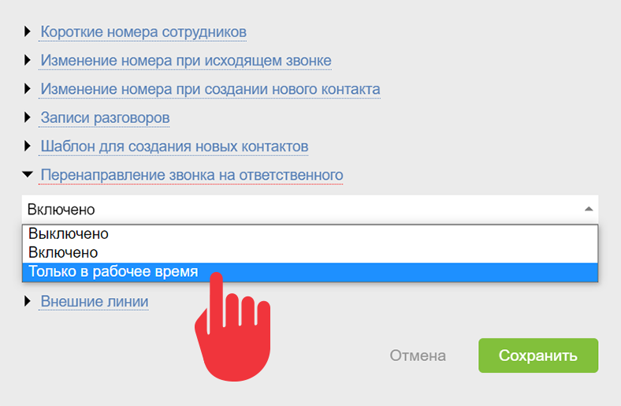

При интеграции с [ телефонией](Виртуальные_АТС.md "Виртуальные АТС") ПланФикс позволяет [ создавать новый контакт](Создание_нового_контакта_по_звонку.md "Создание нового контакта по звонку") для клиента, позвонившего впервые. Вы можете управлять назначением [ ответственных сотрудников](Ответственный.md "Ответственный"), которые будут автоматически закрепляться за создаваемым таким образом контактом. В дальнейшем, входящие звонки от этого контакта будут [ переадресовываться на ответственного](Ответственный.md "Ответственный"). 

  

Существует два способа задания ответственных: 

1\. Сотрудники, которых вы добавите в поле **Ответственные** [ шаблона нового контакта](Шаблоны_контактов.md "Шаблоны контактов"), будут автоматически назначены ответственными за каждый создаваемый по этому шаблону контакт. 

2\. Если оставить поле **Ответственные** в шаблоне контакта пустым, то в созданном при входящем звонке контакте в это поле будет автоматически занесен сотрудник, принявший звонок. Эта опция работает без дополнительной настройки и имеет следующие ограничения: 

  * Поле заполняется в течение 5 минут с момента создания контакта. Это связано с техническими особенностями интеграции.

  * Эта опция работает только при интеграциях со следующими виртуальными АТС: 

    * [ Altegro](Интеграция_с_Altegro.md "Интеграция с Altegro")

    * [ Авантел](Интеграция_с_Авантел.md "Интеграция с Авантел")

    * [ Beeline Кыргызстан](Интеграция_с_Beeline_Кыргызстан.md "Интеграция с Beeline Кыргызстан")

    * [ Binotel](Интеграция_с_Binotel.md "Интеграция с Binotel")

    * [ ВекторТел](Интеграция_с_ВекторТел.md "Интеграция с ВекторТел")

    * [ ВестКолл](Интеграция_с_ВестКолл.md "Интеграция с ВестКолл")

    * [Вестколл СПб](Вестколл_СПб.md "Вестколл СПб")

    * [ Virgin Connect](Интеграция_с_Virgin_Connect.md "Интеграция с Virgin Connect")

    * [ Гарс Телеком](Интеграция_с_Гарс_Телеком.md "Интеграция с Гарс Телеком")

    * [ Гравител](Интеграция_с_Гравител.md "Интеграция с Гравител")

    * [Деловая Сеть - Иркутск](Деловая_Сеть_-_Иркутск.md "Деловая Сеть - Иркутск")

    * [ Дом.ру](Интеграция_с_Дом.ру.md "Интеграция с Дом.ру")

    * [ Easytel](Интеграция_с_Easytel.md "Интеграция с Easytel")

    * [ KCell](Интеграция_с_KCell.md "Интеграция с KCell")

    * [ Zadarma](Интеграция_с_Zadarma.md "Интеграция с Zadarma")

    * [ Mango](Интеграция_с_Mango_Office.md "Интеграция с Mango Office")

    * [ Мегафон](Интеграция_с_Мегафон.md "Интеграция с Мегафон")

    * [ МГТС](Интеграция_с_МГТС.md "Интеграция с МГТС")

    * [ Moldcell](Интеграция_с_Moldcell.md "Интеграция с Moldcell")

    * [ Наука-Связь](Интеграция_с_Наука-Связь.md "Интеграция с Наука-Связь")

    * [ NETBYNET](Интеграция_с_NETBYNET.md "Интеграция с NETBYNET")

    * [ RiNet](Интеграция_с_RiNet.md "Интеграция с RiNet")

    * [ Сибирские сети](Интеграция_с_Сибирские_сети.md "Интеграция с Сибирские сети")

    * [ Телфин](Интеграция_с_Телфин.md "Интеграция с Телфин")

    * [ TechForYou](Интеграция_с_TechForYou.md "Интеграция с TechForYou")

    * [ ТТК](Интеграция_с_ТТК.md "Интеграция с ТТК")

    * [ UIS](Интеграция_с_UIS.md "Интеграция с UIS")

    * [ Электронный город. Бизнес](Интеграция_с_Электронный_город_Бизнес.md "Интеграция с Электронный город Бизнес")

    * [ Энфорта](Интеграция_с_Энфорта.md "Интеграция с Энфорта")

    В остальных АТС в таком случае в поле **Ответственный** будет добавлен сотрудник, которому первоначально был направлен звонок, даже если трубку в итоге поднял не он.

  

## Обратите внимание

При следующей настройке направления звонка, в случае, если указано несколько ответственных за контакт, звонок поступает только тем, у которых задано рабочее время: 

