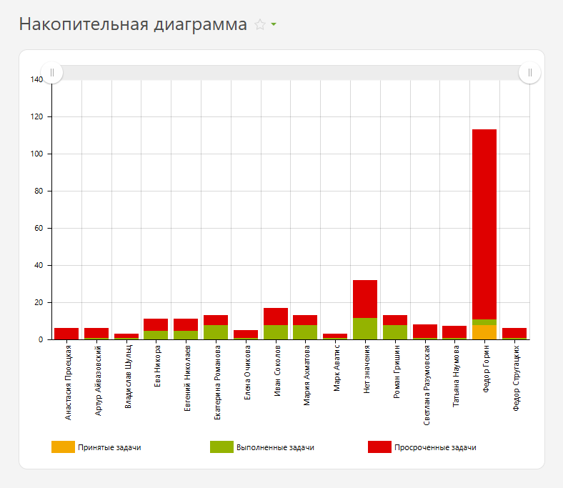
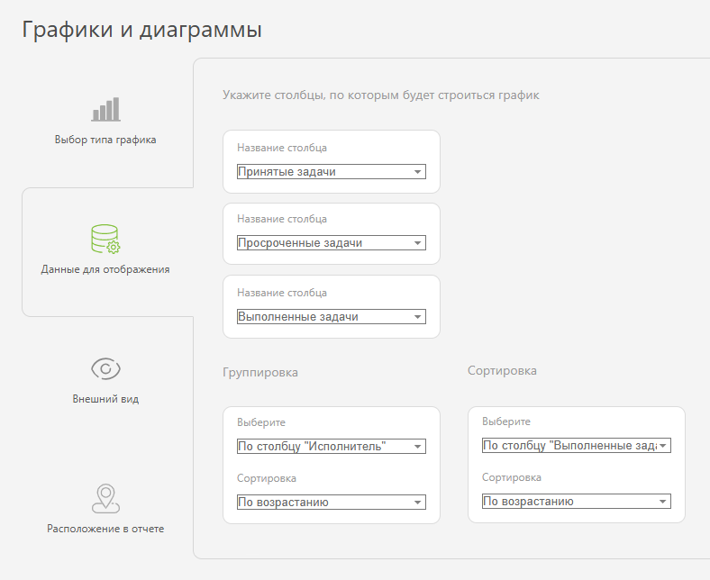
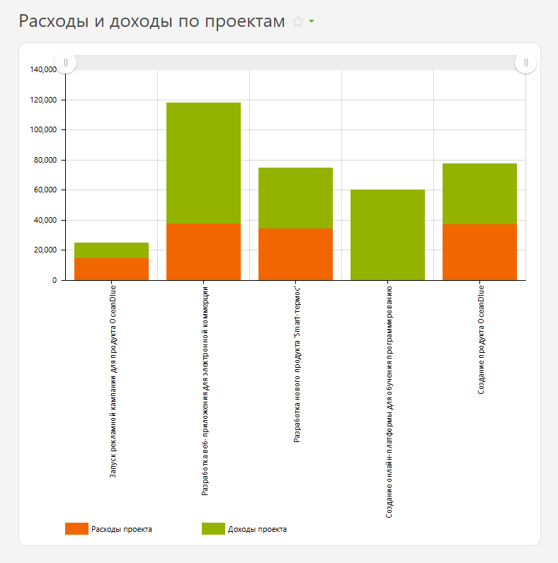
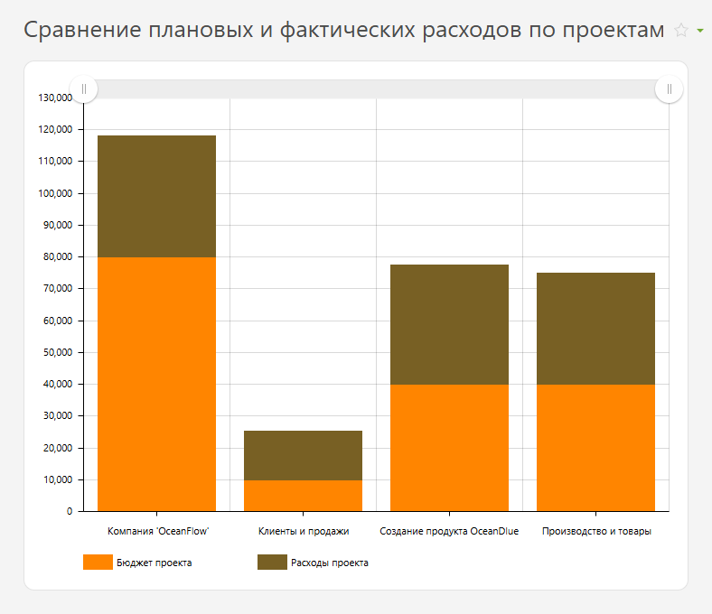
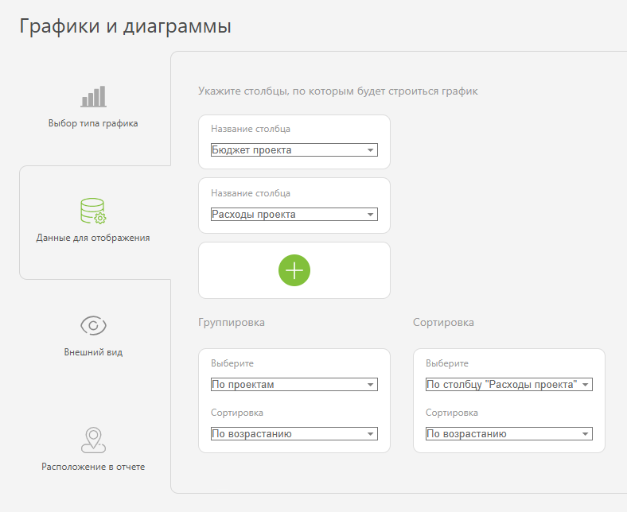
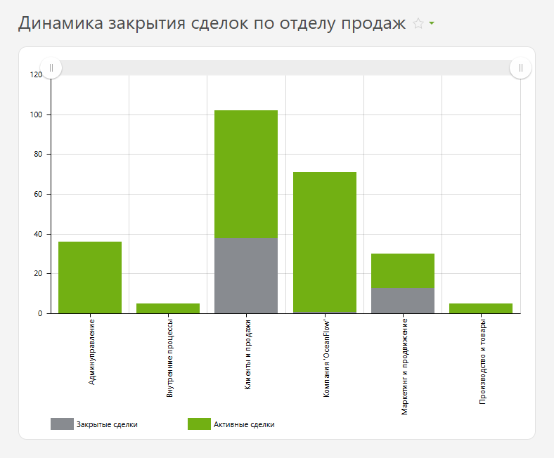
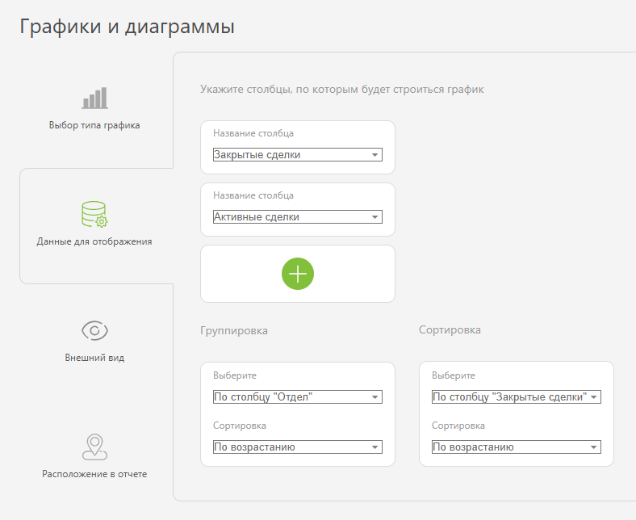

Накопительная диаграмма — это тип диаграммы в [отчетах](Отчеты__Графики_в_отчетах.md "Отчеты: Графики в отчетах") ПланФикса. Данные представлены в виде столбцов, разделенных на сегменты. Каждый сегмент показывает, какую часть в столбце занимает определенная категория. 

Например, так могут отображаться принятые, выполненные и просроченные задачи каждого сотрудника: 

## Как настроить

  * В «Вид отчета» добавьте столбцы с данными, по которым будет собрана накопительная диаграмма.

  * Далее в разделе «Графики и диаграммы» добавьте новый график типа «Накопительная диаграмма»:

    

  

  * В «Данные для отображения» укажите значения:

  * Столбцы: «Принятые задачи», «Просроченные задачи», «Выполненные задачи».

  * Группировка: По столбцу «Исполнитель».

  * Сортировка: По столбцу «Выполненные задачи» и по возрастанию.

    

  

  * В «Внешнем виде» настройте отображение графика: 

    * Высота графика — определяет высоту отображаемого графика в пикселях.

    * Расположение подписей — определяет, как будут отображаться подписи осей. "Вертикально" позволяет компактно разместить длинные подписи, а "Горизонтально" подходит для более коротких значений.

  * Цвета элементов — позволяет различать группы данных на графике с помощью разных цветов.

    

  * Сохраните график и запустите отчет для просмотра.

## Примеры использования

  * Расходы и доходы по проектам.

  

  * Сравнение плановых и фактических расходов по проектам.

  

  * Динамика закрытия сделок по отделу продаж.

