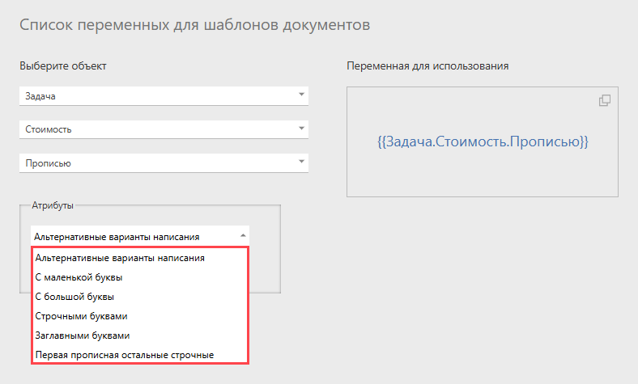

Переменные пользовательских полей типа [ Число](Число.md "Число") в [шаблонах документов](Шаблоны_документов.md "Шаблоны документов") можно отображать прописью в различных вариантах: 

## Важно

Для написания числа прописью на другом языке используйте атрибут **lang**. 

Примеры: 

  * {{Задача.Бюджет.Прописью::lang=ru}} — русский

  * {{Задача.Бюджет.Прописью::lang=en}} — английский

  * {{Задача.Бюджет.Прописью::lang=uk}} — украинский
