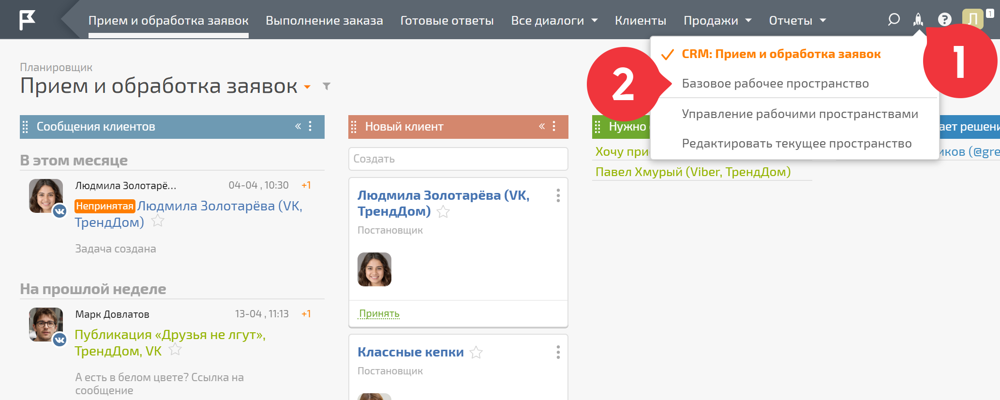
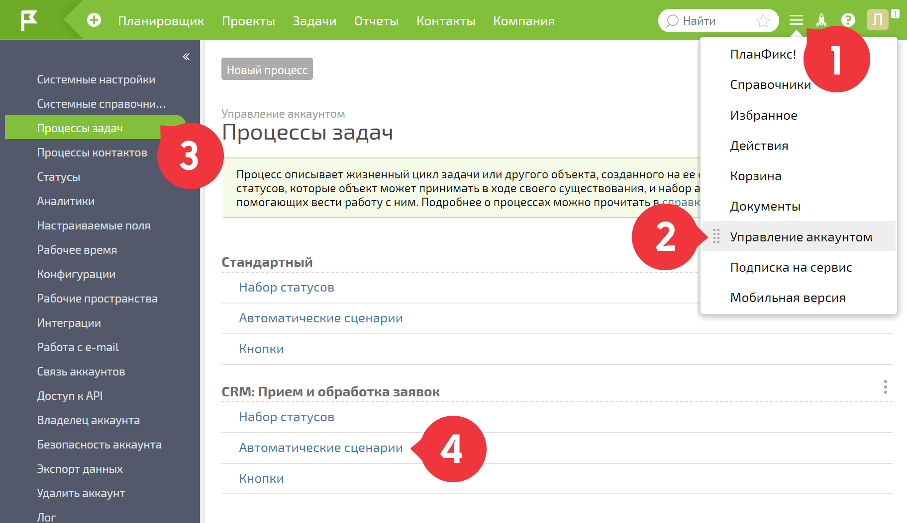

Одно из правил, которым руководствуется команда ПланФикса: «Работать должны роботы». Этому принципу следует и конфигурация [ CRM: Прием и обработка заявок](CRM__Прием_и_обработка_заявок.md "CRM: Прием и обработка заявок"). Когда что-то будет идти не так, как запланировано уже настроенными автоматическими сценариями конфигурации, в уведомлениях вы увидите сообщения от робота Евы. Её работа видна в следующих случаях: 

  * **прошло 2 часа** с момента перевода задачи в статус "Нужно ответить клиенту" — робот оповестит об этом и предложит перевести задачу в один из статусов, когда ответ с вашей стороны не требуется;

  * **прошел 1 день** , как задача находится в статусе "Мы принимаем решение" — робот предложит написать клиенту, если решение вами уже принято или предложит поставить себе напоминание, чтобы не упустить задачу из виду;

  * **прошло 3 дня** , как задача находится в статусе "Клиент принимает решение" — робот предложит напомнить клиенту о сделке или перевести её в статус "Ожидаем ответа от клиента", если напоминание не требуется.

Описанная автоматизация, работающая на базе [ автоматических сценариев](Автоматические_сценарии.md "Автоматические сценарии"), может быть выключена или настроена для нужд именно вашей компании. Для этого: 

  * смените рабочее пространство на базовое:

  

  * перейдите в **Управление аккаунтом** ― **Процессы задач** – **CRM: Прием и обработка заявок** ― **Автоматические сценарии** :

  

  * выберите автоматический сценарий, который хотите изменить.

Например, необходимо изменить время, через которое робот Ева будет напоминать сотруднику, что необходимо ответить клиенту. Выбираем автоматический сценарий **Задача находится в статусе "Нужно ответить клиенту" 2 часа** и в 3 пункте параметров сценария **Ставить сценарий в очередь на выполнение** вносим необходимые изменения: 

  

  * не забудьте сохранить настройки.

  

По такому же принципу можно настроить работу и других автоматических сценариев конфигурации.
