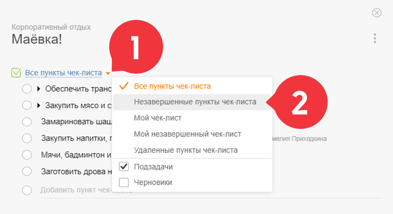
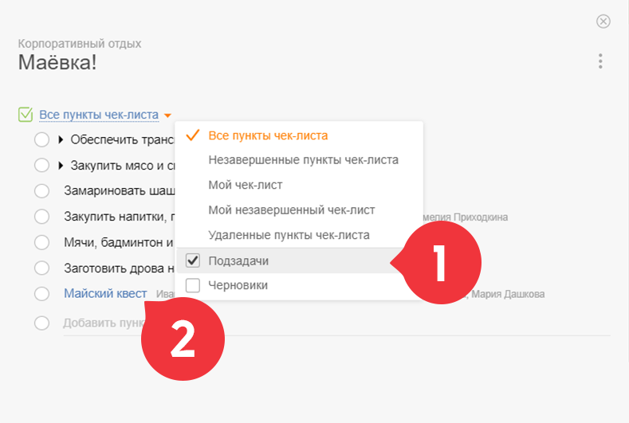
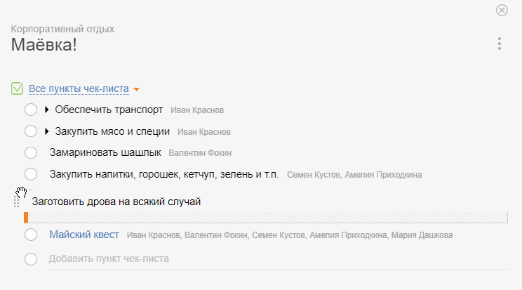
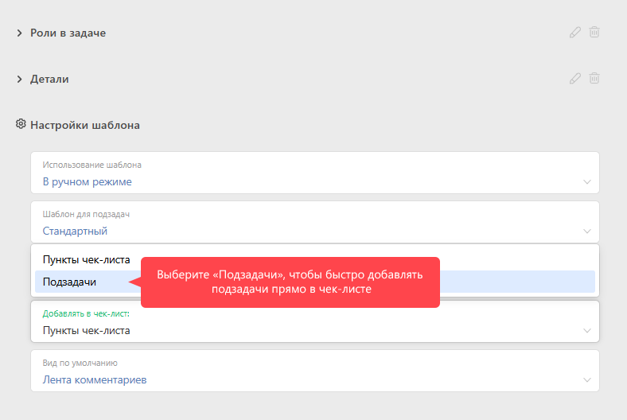

Вы можете управлять видимостью в [чек-листе](Чек-лист.md "Чек-лист") выполненных пунктов, а также пунктов, относящихся к вам или к другим участникам [задачи](Задачи.md "Задачи"), настроив таким образом удобный для вас вид отображения чек-листа: 

## Видимость пунктов чек-листа

  * **Все пункты чек-листа** — отображаются все пункты чек-листа, за исключением удаленных.

  * **Незавершенные пункты чек-листа** — отображаются все пункты чек-листа, за исключением удаленных и завершенных.

  * **Мой чек-лист** — отображаются пункты чек-листа без исполнителей, пункты чек-листа, где сотрудник исполнитель, и подзадачи, где сотрудник постановщик или исполнитель.

  * **Мой незавершенный чек-лист** — отображаются незавершённые пункты чек-листа без исполнителей, пункты чек-листа, где сотрудник исполнитель, и подзадачи, где сотрудник постановщик или исполнитель.

  * **Удаленные пункты чек-листа** — включает только пункты чек-листа, которые были удалены.

## Отображение подзадач в чек-листе

В чек-листе могут отображаться в том числе и [подзадачи](Подзадачи.md "Подзадачи"): 

## Упорядочивание пунктов чек-листа

Пункты чек-листа можно упорядочивать и менять местами в удобном порядке. Для этого хватаемся за пункт чек-листа слева и перетаскиваем его на нужную позицию 

## Важно

  * В [шаблоне задачи](Шаблоны_задач.md "Шаблоны задач") можно указать, что создавать в [чек-листе](Чек-лист.md "Чек-лист") по умолчанию — пункт чек-листа или подзадачу:

## Полезные ссылки

  * [Блог ПланФикса: чек-листы и подзадачи](http://planfix.livejournal.com/14023.html)

  * [ Как настроить отображение подзадач в виде чек-листа](Подзадачи.md "Подзадачи")

  * [Удобства работы с чек-листами в ПланФиксе](https://planfix.com/ru/blog/svorachivanie-chek-listov/)
