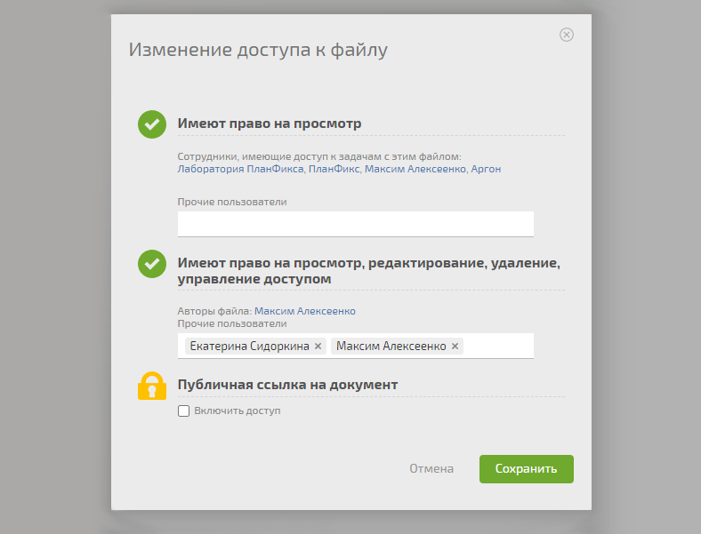

Доступы к документам настраиваются так: 

  * Перейдите в задачу, где расположен документ.

  * Откройте документ, права доступа которого хотите изменить.

  * Нажмите на панели кнопку **«Доступ»**

  * В появившемся окне можно просмотреть текущие права доступа к файлу или изменить их:

