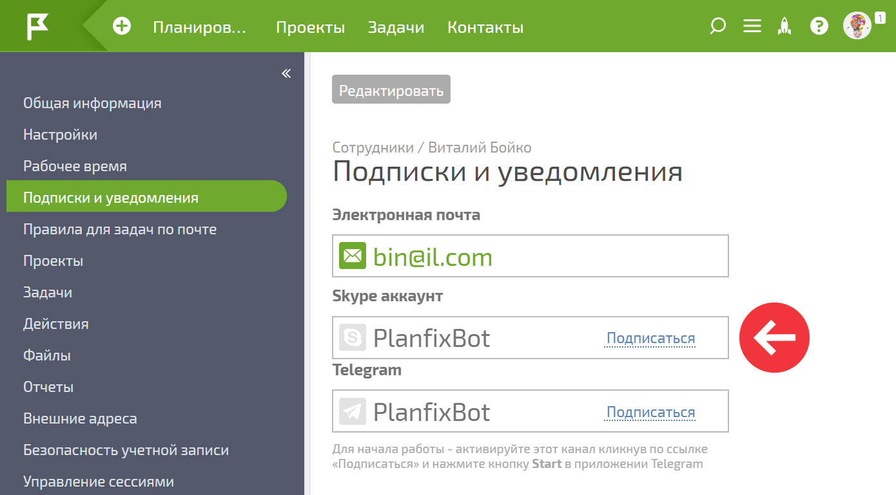
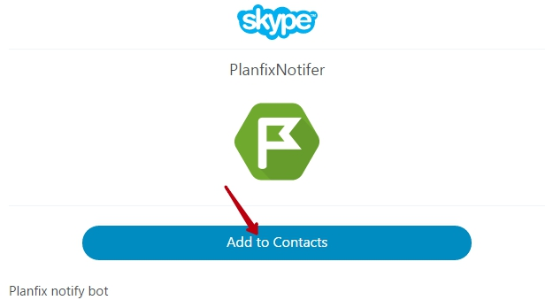
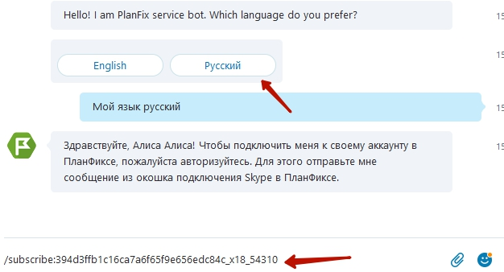
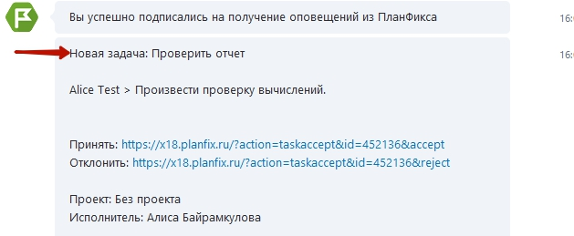

* * *

**Важно:** В связи с прекращением поддержки ботов со стороны Microsoft, описанные ниже возможности могут работать с ограничениями или не работать в принципе. 

* * *

  

  

ПланФикс позволяет настроить получение [ уведомлений](Подписки_и_уведомления.md "Подписки и уведомления") о новых задачах и комментариях в Skype. 

Для этого нужно зайти в свою [ карточку пользователя](Страница_пользователя.md "Страница пользователя") и подписаться на Skype бота ПланФикс: 

  

После этого вам будет предложено добавить бота в список контактов и сообщить ему код в сообщении: 

  

  

После перехода по указанной ссылке нажмите кнопку Добавить в список контактов: 

  

  

Выберите язык общения и введите предварительно скопированное сообщение для бота: 

  

  

После этого уведомления по активным для этого канала подпискам будут приходить в Skype: 

  

