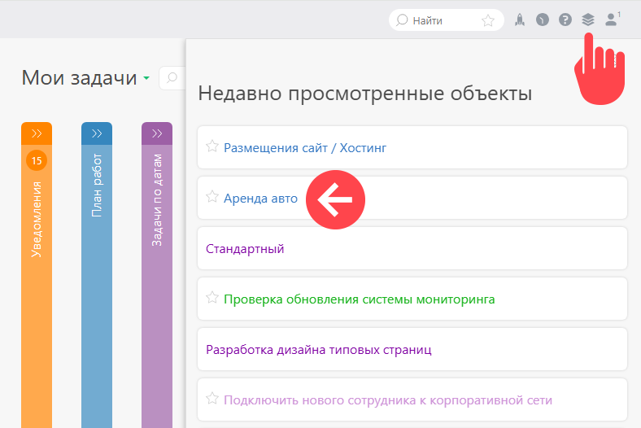

ПланФикс сохраняет список просмотренных [задач](Задачи.md "Задачи") или [контактов](Контакты.md "Контакты") в разделе **Недавно просмотренные объекты** : 

## Важно

  * В разделе отображается история просмотров последних 50-ти задач и контактов.

## Дополнительно

  * [Меню быстрого доступа к последним объектам ПланФикса](https://planfix.com/ru/blog/menyu-bystrogo-dostupa-k-poslednim-obektam-planfiksa/)
