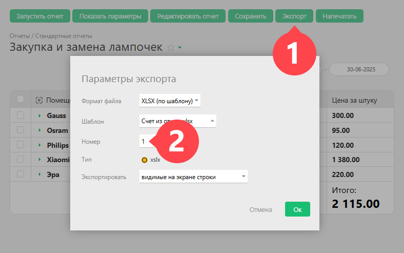

При экспорте данных из отчета можно задать номер документа: 

  

  * При каждом экспорте отчета по данному шаблону этот номер будет автоматически увеличиваться на 1.

  * Если задать номер в окошке вручную, в этот раз в переменной **Отчет.Номер документа** будет использоваться введенный номер.

  * В следующий раз будет предложен этот номер +1.

Номер документа используется как внутри шаблона, так и в наименовании итогового файла, формируемого при экспорте.
