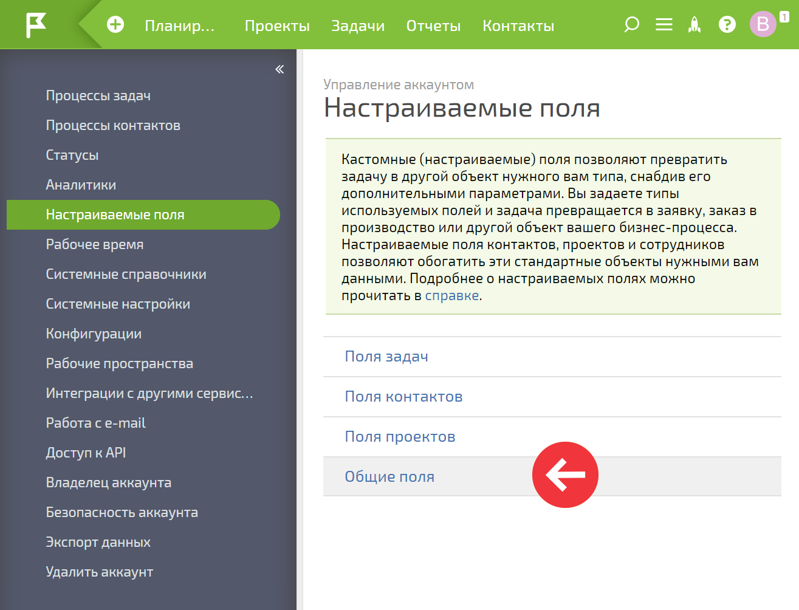

**Общие поля** — это один из видов настраиваемых пользовательских полей, наряду с [ полями задач](Пользовательские_поля_задачи.md "Пользовательские поля задачи"), [ контактов](Как_добавить_новое_поле_в_карточку_контакта.md "Как добавить новое поле в карточку контакта") и [ проектов](Пользовательские_поля_проекта.md "Пользовательские поля проекта"). Они служат для хранения информации, которую планируется использовать на уровне всего аккаунта, например в [ шаблонах документов](Шаблоны_документов.md "Шаблоны документов"). 

  

Создание и заполнение значениями общих полей происходит в разделе **Управление аккаунтом** — **Настраиваемые поля** — **Общие поля** : 

