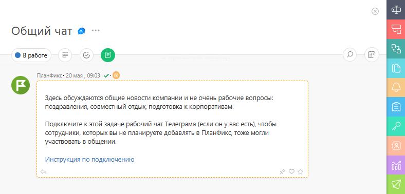

Во всех новых аккаунтах ПланФикса автоматически создается системная задача «Общий чат». В общем чате идет общение, не связанное с конкретной задачей. Нажав на название, вы откроете карточку задачи. В ней первое сообщение от системного робота ПланФикса: 

  

Этот же системный робот является [постановщиком](Постановщик_задачи.md "Постановщик задачи") задачи, а [ участники](Участники_задачи.md "Участники задачи") — все сотрудники. 

## Важно

  * Задачу «Общий чат» удалить нельзя, но можно [ изменить](Как_изменить_статус_задачи_.md "Как изменить статус задачи?") ее статус на **Завершенная**.

  * Отписаться от уведомлений по задаче можно на панели [ Уведомления](Панель_Уведомления.md "Панель Уведомления").

  * В старых аккаунтах задачи «Общий чат» нет, но с помощью операции автоматического сценария «Написать в Общий чат», задача будет создана.
