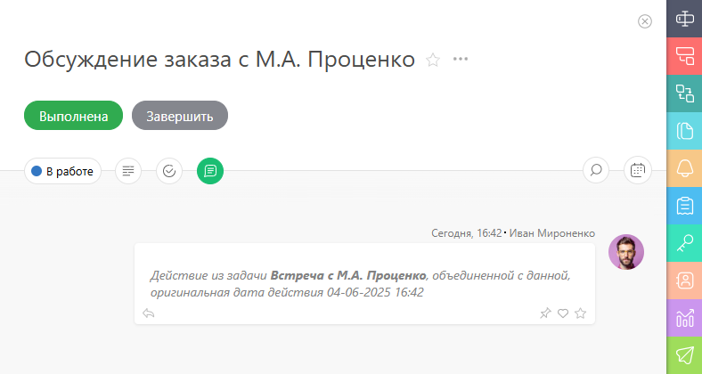

[Задачи](Задачи.md "Задачи") в ПланФиксе можно объединять. Для этого перейдите в раздел **Задачи** : 

  * Выделите галочкой нужные задачи и нажмите кнопку **Изменить**.

  * Затем выбрерите пункт **Объединить** и укажите в какую из задач нужно сделать объединение. 

    * _Обратите внимание, опция «Не уведомлять об изменениях» доступна исключительно[Администраторам](Роли_в_ПланФиксе.md "Роли в ПланФиксе") аккаунта._

По событию **Задача объединена с другой задачей** можно запускать [автоматический сценарий](Автоматические_сценарии.md "Автоматические сценарии") для выполнения различных операций: 

    _Обратите внимание, сценарий срабатывает на той задаче, в которую произошло объединение_.

## Важно

  * Для объединения задач необходимо права на редактирование объединяемых задач.

  * Объединение задач — необратимая процедура.

  * После объединения в ленте действий по задаче появится соответствующая запись:

  

  * Если в объединяемых задачах были комментарии, то в объединенной задаче они будут расположены в хронологическом порядке. Те комментарии, которые были перенесены из другой задачи, будут содержать информацию об этом:

