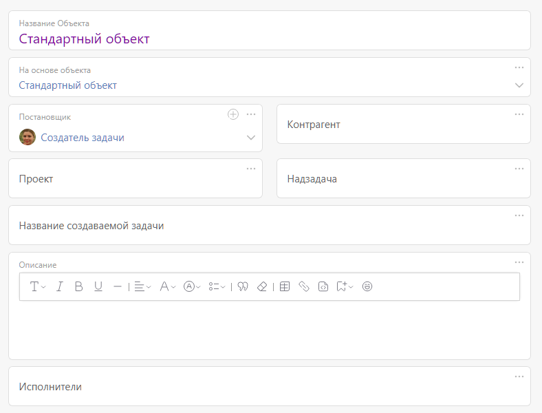

**Объект** — цифровой двойник физического объекта или процесса из реального мира внутри ПланФикса. 

Каждый Объект описывает определенный тип Задач, которые будут обрабатываться в ПланФиксе. Примеры Объектов: 

  * Сделка

  * Встреча

  * Новость

  * Статья Базы знаний

  * и т.п.

В каждом аккаунте есть как минимум один Объект. Обычно он представляет собой стандартную карточку и жизненный цикл задачи в ее самом привычном понимании, как задача в любой системе управления задачами: 

  

Если вам нужно добавить в ПланФикс новую сущность, например Сделку, Встречу или Базу Знаний — создайте новый Объект. 

## Создание Объекта

Для того, чтобы добавить новый Объект в ПланФикс, перейдите в «Управление аккаунтом» — «Объекты». 

У Объекта в ПланФиксе есть: 

  * **[Карточка](Карточка_объекта.md "Карточка объекта")** — набор [полей](Пользовательские_поля.md "Пользовательские поля"), позволяют описать реальные свойства физического объекта или процесса. Например, для Сделки вам скорее всего понадобится добавить в форму название клиента и бюджет, для Встречи — время, место и участников, для Базы Знаний — теги.

  * **[Набор статусов](Набор_статусов_Объекта.md "Набор статусов Объекта")** — перечень [статусов-состояний](Какой_смысл_в_статусах_задач_.md "Какой смысл в статусах задач?"), в которых может находиться Объект. Например, для Сделки — переговоры, заключение договора, ожидание оплаты.

  * **[Автоматические сценарии](Автоматические_сценарии_Объекта.md "Автоматические сценарии Объекта")** — срабатывающие на изменения значений полей.

  * **[Кнопки](Кнопки_Объекта.md "Кнопки Объекта")** — автоматизируют набор каких-то действий и доступны в определенных состояниях.

## Видеоинструкция

[Смотреть видео на YouTube](https://www.youtube.com/watch?v=s-kEa9wmWts)

  

В [ настройках карточки сотрудника](Настройки_в_карточке_пользователя.md "Настройки в карточке пользователя") или [ контакта с доступом в ПланФикс](Внешний_пользователь.md "Внешний пользователь") есть возможность [выбрать Объект (шаблон)](Шаблон_задачи_по_умолчанию.md "Шаблон задачи по умолчанию"), по которому он будет создавать задачи. 

## Важно

  * Объект — это относительно новый для ПланФикса конструкт. До его появления добавление новых сущностей и настройка бизнес-процессов происходила при помощи раздельного создания [Шаблонов задач](Шаблоны_задач.md "Шаблоны задач"), которые отвечали за форму, и [Процессов задач](Процессы.md "Процессы"), которые содержали наборы статусов, автоматические сценарии и кнопки.

  * Старый способ настройки сохранен для обратной совместимости и вы можете встречать справочные и обучающие материалы, которые демонстрируют его использование.

  * Для более удобной работы и доступа ко всем возможностям ПланФикса мы рекомендуем использовать Объекты.
