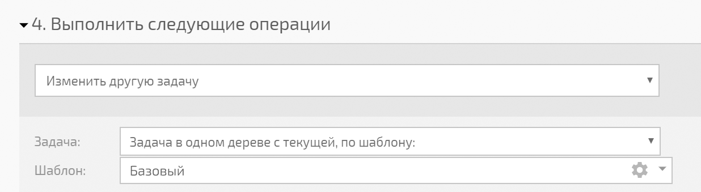
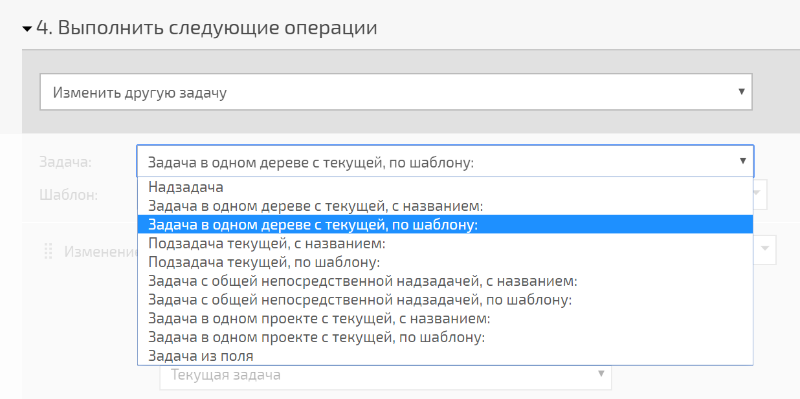

## Изменить другую задачу

При использовании [ операции](Операции_в_автоматических_сценариях.md "Операции в автоматических сценариях") **Изменить другую задачу** важно понимать, что если критериям выбора изменяемой задачи соответствует несколько задач, то изменения будут проведены **только в одной из них**. При этом нет способа указать, в какой именно. Поэтому важно использовать критерий, который позволяет однозначно адресоваться именно к нужной в данной ситуации задаче. 

Пример использования данной операции в сценарии: 

  

В этом случае будет изменена задача, созданная по шаблону "Базовый" и находящаяся [в одном дереве](Задача_в_одном_дереве_с_текущей.md "Задача в одном дереве с текущей") с задачей, в которой сработало событие, вызвавшее сценарий. Если в этом дереве несколько задач, созданных по шаблону "Базовый", есть вероятность, что операция изменит не ту задачу, которую вы ожидаете. Поэтому для четкого позиционирования рекомендуется использовать уникальный [ шаблон](Шаблоны_задач.md "Шаблоны задач"), по которому будет создаваться только одна такая задача на каждое дерево задач. Под деревом задач стоит понимать все задачи, начиная с самой верхней, которая без родительской задачи. 

Альтернативный способ - использовать другой вариант адресации к нужной задаче. Список доступных вариантов: 

## Изменить другие задачи

Операция **Изменить другие задачи** позволяет в автоматическом режиме производить массовые изменения в наборе задач, соответствующих указанному в операции критерию. Важным нюансом использования этого типа операции является то, что **максимально с ее помощью может быть изменено 150 задач**. 

Если под указанный вами критерий отбора подпадает большее количество задач, будет изменено только 150 из них. При этом нет способа гарантированно повлиять на то, какие именно задачи будут изменены. Поэтому в случае необходимости проведения массовых изменений более чем 150 задач следует использовать [массовые действия над задачами](Массовые_действия_над_задачами.md "Массовые действия над задачами"), которые не имеют такого ограничения.
