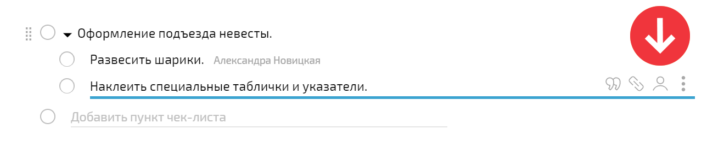
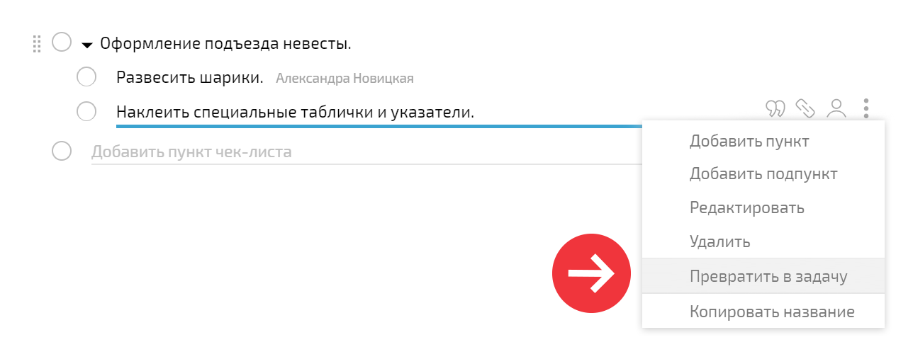
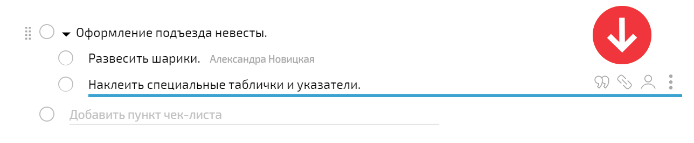

## Исполнители чек-листа

Каждому пункту [ чек-листа](Чек-лист.md "Чек-лист") может быть назначен один или несколько [ исполнителей](Исполнители_задачи.md "Исполнители задачи"): 

  

  * Если исполнители назначены, то отметить выполненным этот пункт могут только они или автор [задачи](Задачи.md "Задачи").

  * Если исполнители не назначены, отметить выполненным пункт может любой из исполнителей задачи.

Исполнитель может отметить все назначенные ему пункты чек-листа выполненными и перевести задачу в [ статус](Как_изменить_статус_задачи_.md "Как изменить статус задачи?") "Выполнена". При этом для остальных исполнителей задача по-прежнему будет иметь статус "В работе". Автор задачи увидит статус "Выполнена" только после того, как все исполнители отметят все назначенные им пункты чек-листа как выполненные и переведут статус задачи в "Выполнена". 

Такой подход позволяет разбить большую задачу на несколько кусков, назначить каждому своего исполнителя и отслеживать выполнение как отдельных частей, так и задачи целиком. При этом выполнивший свою часть работы исполнитель не видит задачу в списке "В работе" и не отвлекается на нее. 

Важно: 

  * при создании задачи или [ шаблона](Шаблоны_задач.md "Шаблоны задач") исполнителя для пункта чек-листа можно выбрать из общего списка пользователей, при этом выбранные исполнители автоматически добавятся в список исполнителей задачи;

  * при редактировании задачи или шаблона исполнителя для пункта чек-листа можно выбрать только из числа уже имеющихся исполнителей задачи - поэтому если необходимо установить исполнителем пользователя, ранее не подключенного к задаче, нужно предварительно добавить его в список исполнителей задачи;

  * если пункт чек-листа создал один сотрудник, а исполнителем назначен другой, то за автором пункта чек-листа сохраняется право отметить его выполненным. Даже если он находится в статусе участника задачи.

## Дополнительное меню

При наведении на пункт чек-листа становится доступным дополнительное меню: 

  

## Перевод пункта чек-листа в подзадачу

Чек-лист и [подзадачи](Подзадачи.md "Подзадачи") в ПланФиксе очень тесно связаны, поэтому из пункта чек-листа можно сделать полноценную подзадачу. Это актуально в случаях, когда первоначальная оценка сложности задачи была проведена слишком оптимистично, и каждый пункт чек-листа вырастает в отдельную задачу, с развернутым описанием и общением между исполнителями. Перевести пункт чек-листа в подзадачу можно в дополнительном меню пункта: 

  

Если чек-лист создавал один сотрудник, а в задачу его превращает другой (т.е. это не ситуация я сам создал чек-лист и сам его превратил в задачу) — постановщиком в нём становится постановщик задачи, где был чек-лист. 

## Ссылка на комментарий, в котором был добавлен пункт чек-листа

Нажав на пиктограмму с изображением ссылки, вы перейдете на комментарий, в котором был добавлен этот пункт чек-листа. Это позволяет получить дополнительную информацию о контексте его добавления из текста этого комментария: 

  

## Полезные ссылки

  * [Блог ПланФикса: чек-листы и подзадачи](http://planfix.livejournal.com/14023.html)

  * [ Как настроить отображение подзадач в виде чек-листа](Подзадачи.md "Подзадачи")
