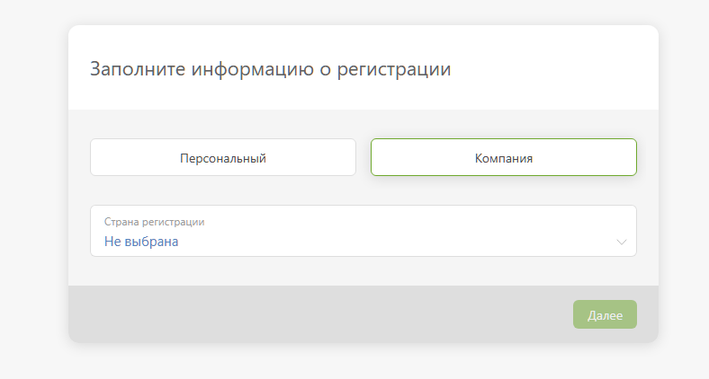
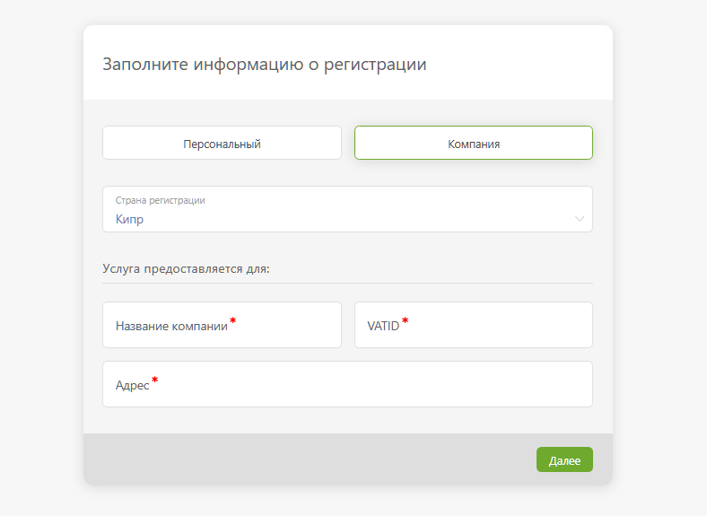
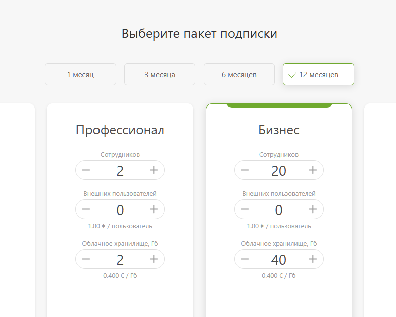

Вы можете оплатить использование ПланФикса безналичным банковским платежом. 

Для этого: 

  * Выберите страну:

  

  * Заполните данные компании:

  

  * Выберите пакет подписки и способ оплаты «Банковский платеж»:

  

  * Если ПланФикс поддерживает прием оплаты безналичным банковским переводом из вашей страны, то в способах оплаты он будет предложен:

  

  * Запросите счёт.

Вы будете напрямую контактировать с представителем ПланФикса и сможете согласовать с ним любые вопросы, касающиеся оплаты сервиса. 

## Важно

  * При оплате посредством безналичного платежа пользователю отправляются закрывающие документы (акты) почтой или через ЭДО.
