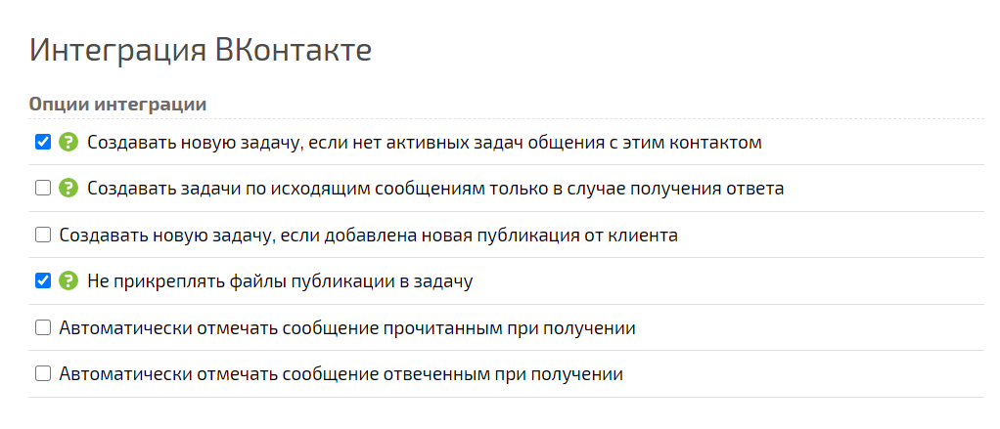
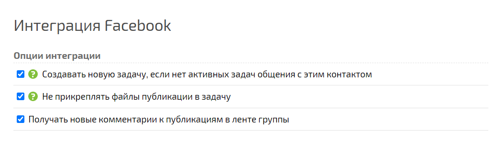
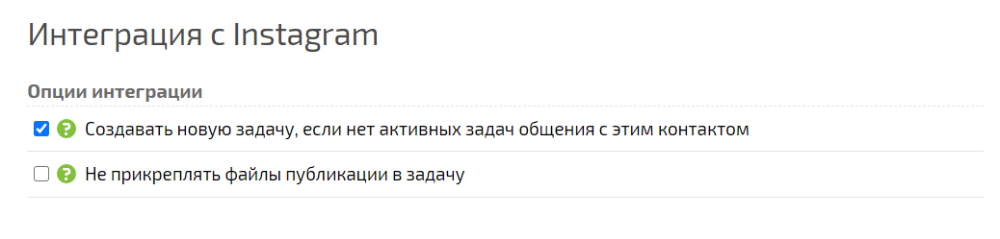

Комментарии под публикацией в социальных сетях добавляются в ПланФикс в виде задачи. Если публикация содержит изображения, они будут также добавлены к задаче в описание. Активировав опцию интеграции **Не прикреплять файлы публикации в задачу** , изображения добавляться к описанию задачи не будут: 

  

  

