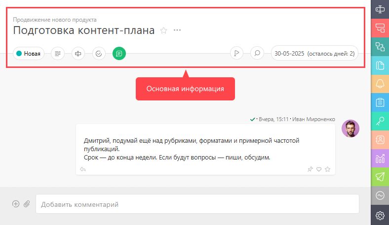

Суть этого блока определяется его названием: он содержит ключевую информацию по [задаче](Задачи.md "Задачи"), которая с большой долей вероятности может понадобиться в ходе работы над ней. 

  

Остальная информация выводится в [ панелях дополнительной информации](Вкладки.md "Вкладки"), которые открываются по клику на пиктограммах бокового меню. 

На панели с основной информацией можно также [ отображать дополнительные пользовательские поля задачи](Отображение_пользовательских_полей_при_просмотре_задачи.md "Отображение пользовательских полей при просмотре задачи") и [динамические блоки](Динамические_блоки.md "Динамические блоки").
