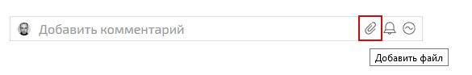
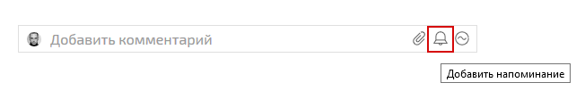
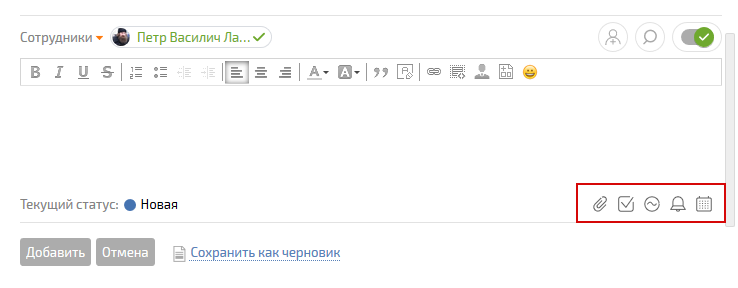
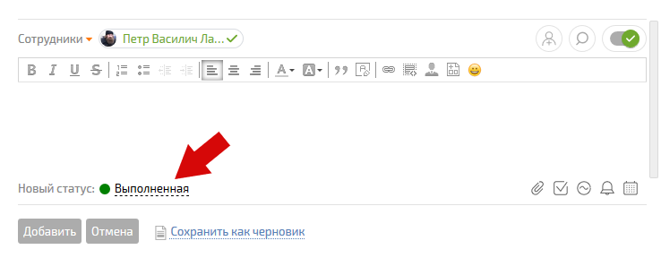

## Где посмотреть список своих задач:

  * Раздел **Планировщик** \- сразу при входе в ПланФикс вы попадаете в планировщик **Сводные данные** , где можете видеть свои задачи по дням + быстро ставить задачи на нужный день/время + планировать и распределять задачи (см. [видео](https://www.youtube.com/watch?v=0QMzttERmDg))

  * Раздел **Задачи** : 

    * Входящие - задачи, которые поставили Вам

    * Исходящие - задачи, которые поставили Вы

  * Раздел **Проекты** : 

    * Есть возможность посмотреть задачи в разрезе конкретных проектов

  

## Принять задачу

Вам будут ставиться задачи. Каждую задачу надо принять в работу: 

  * Если сообщение о новой задаче пришло по e-mail, можно прямо в письме нажать ссылку “Принять”

  * Если Вы внутри ПланФикса: 

    * в Хронике событий (первый список Планировщика **Сводные данные**) видим новое событие, открываем задачу и нажимаем "Принять", или

    * идем в раздел **Задачи - Входящие - Новая** заходим в новую задачу и жмем кнопку “Принять”

  

## Обсуждение по задаче

Если задача, которую вам поставили, требует обсуждения - это надо делать внутри ПланФикса, добавляя к задаче действия. Добавить действие к задаче можно разными способами. Чаще всего используются такие: 

  * Хроника событий в планировщике **Сводные данные** Кликаем на **название задачи** в списке, сразу видим **все действия и комментарии** по ней. Пишем свой комментарий (вопрос, уточнение и так далее) в специально отведенном для этого поле в верхней части ленты комментариев. В списке, расположенном над текстом комментария, выбираем участников задачи, которые должны увидеть ваше сообщение. Жмем “Добавить”, комментарий появится в ленте, уведомления о нем уходят выбранным участникам.

  * **Раздел “Задачи”** : **находим нужную задачу** , входим внутрь и видим все действия и комментарии, которые были добавлены в задачу. Дальнейший порядок действий такой же, как и в первом случае. **Важно:** обязательно выбирайте людей, которые должны узнать о вашем комментарии, иначе они не получат уведомления о нем.

  * **С помощью e-mail** : если вы ответите на письмо от ПланФикса с уведомлением о новой задаче или действии, ваш ответ добавится в эту задачу в качестве комментария. Уведомление об этом комментарии получат те же участники задачи, которые были уведомлены о задаче или комментарии, на которое вы ответили. Таким образом можно вести переписку по задаче, не заходя в ПланФикс.

  

## Дополнительные действия

Вся работа по задаче оформляется действиями в [ карточке задачи](Карточка_задачи.md "Карточка задачи"), например: 

  * Добавление файла: **Новое действие - Клик на иконку со скрепкой:**

  * Добавление напоминания: **Новое действие - Клик на иконку с колокольчиком:**

  * Добавление аналитики: **Новое действие - Клик на иконку со значком аналитики :**

  

Расширенные возможности по добавлению действий появляются при добавлении комментария: 

  

Помните: добавить действие к задаче - лучший способ показать, что вы над ней работаете. 

  

## Когда задача выполнена

Мало выполнить задачу - надо сообщить об этом тому, кто ее поставил. Для этого: 

  * заходим в задачу, добавляем к ней новое действие (см. предыдущий пункт)

  * в действии выбираем **Новый статус: Выполненная**

  * сохраняем действие

Постановщик задачи получит уведомление о том, что вы ее выполнили, поэтому сможет проверить и завершить задачу. Если постановщик посчитает, что задача выполнена неправильно - он поменяет ее статус обратно на “В работе” и сообщит, что именно надо доделать.
