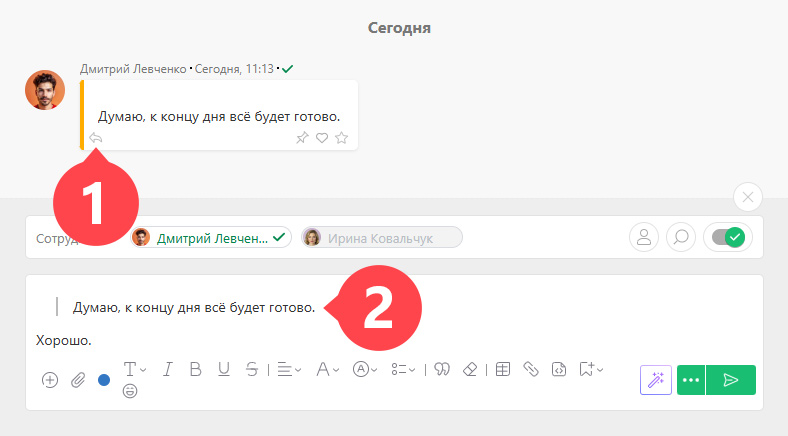

Вы можете отвечать на [ комментарий](Действия__(комментарии_.md) "Действия \(комментарии\)") в один клик, используя кнопку **Ответить**. Нажав на неё, можно быстро создать новый комментарий и процитировать текст, на который отвечаете: 

  

При этом в блоке уведомлений будут сразу выделены те же участники задачи, которые общались в цитируемом комментарии. 

## Важно

  * Если цитируется текст из [скрытого комментария](Скрытые__(приватные_.md)_%D0%BA%D0%BE%D0%BC%D0%BC%D0%B5%D0%BD%D1%82%D0%B0%D1%80%D0%B8%D0%B8 "Скрытые \(приватные\) комментарии"), то новый комментарий по умолчанию тоже будет скрытым.
