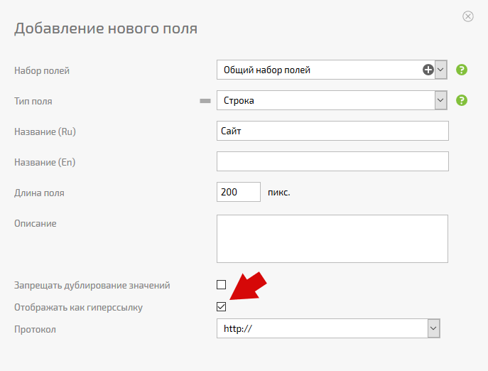
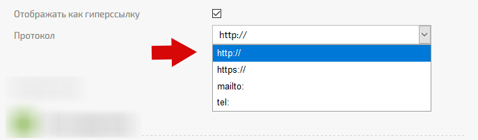

Для [ пользовательского поля](Пользовательские_поля_задачи.md "Пользовательские поля задачи") типа [Строка](Строка.md "Строка") есть возможность активировать признак **Отображать как гиперссылку**. Активация этого признака превратит введенное в поле значение в активную гиперссылку 

  

При этом вы можете выбрать протокол, по которому будет открываться эта ссылка: 

  

## Важно

  * Протокол **file://** позволяет хранить в ПланФиксе ссылку на локальные файлы, размещенные на вашем компьютере или в локальной сети.

  * Корректная работа по протоколу **file://** возможна только в некоторых браузерах и **требует установки дополнительного расширения** браузера. Известные нам сочетания браузера и расширения: 

    * **Google Chrome** и расширение [Enable local file links](https://chrome.google.com/webstore/detail/enable-local-file-links/nikfmfgobenbhmocjaaboihbeocackld)
