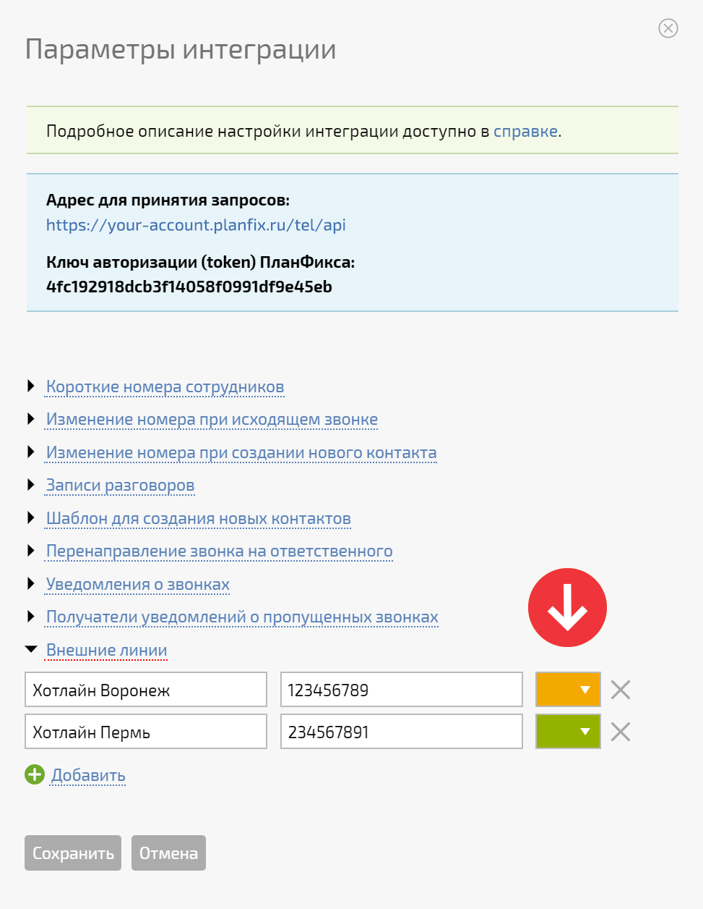

Список используемых линий с говорящими названиями можно задать в настройках интеграции. Там же задается цвет плашки, на которой будет отображаться название линии в окне звонка: 

  

  

В окне входящего звонка название линии, на которую пришел звонок, будет отображаться следующим образом: 

  

  

Если в настройки не заходить и названия линиям не добавлять, то в окне звонка будет отображаться просто номер, на который пришел звонок. 

  

## Полезные ссылки

  * [Телефония: Окно звонка 3.0](https://planfix.com/ru/blog/telefoniya-okno-zvonka-3-0/)
