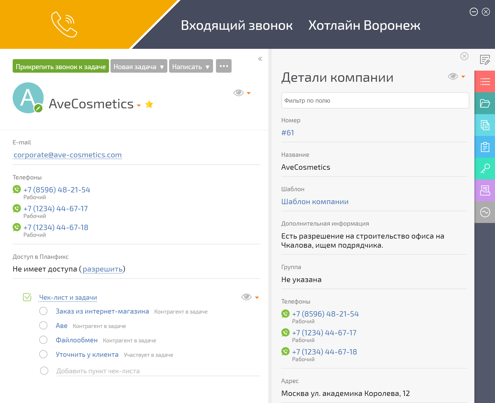
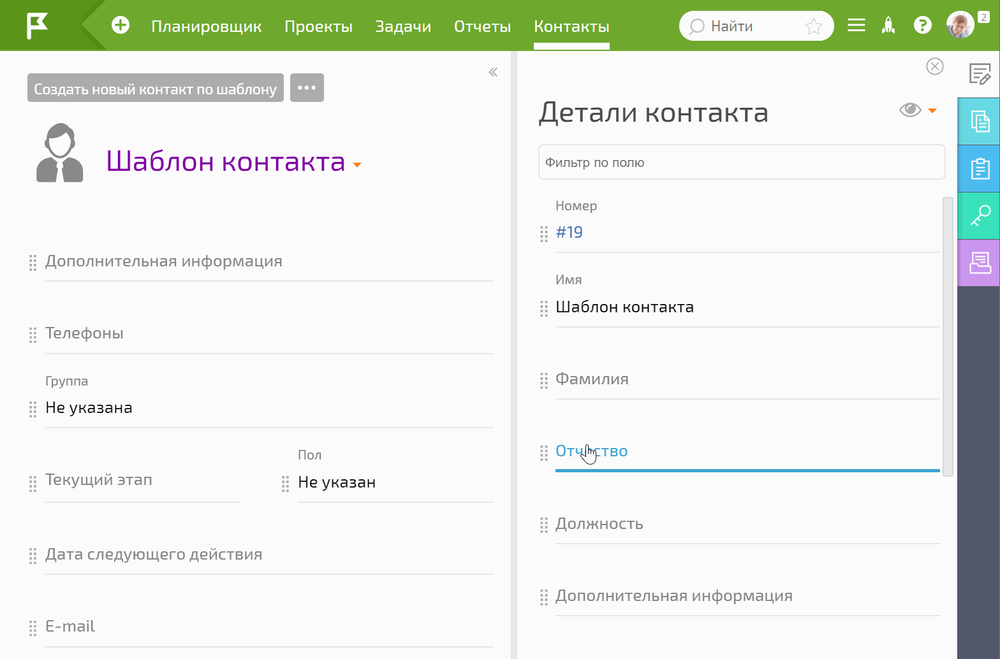
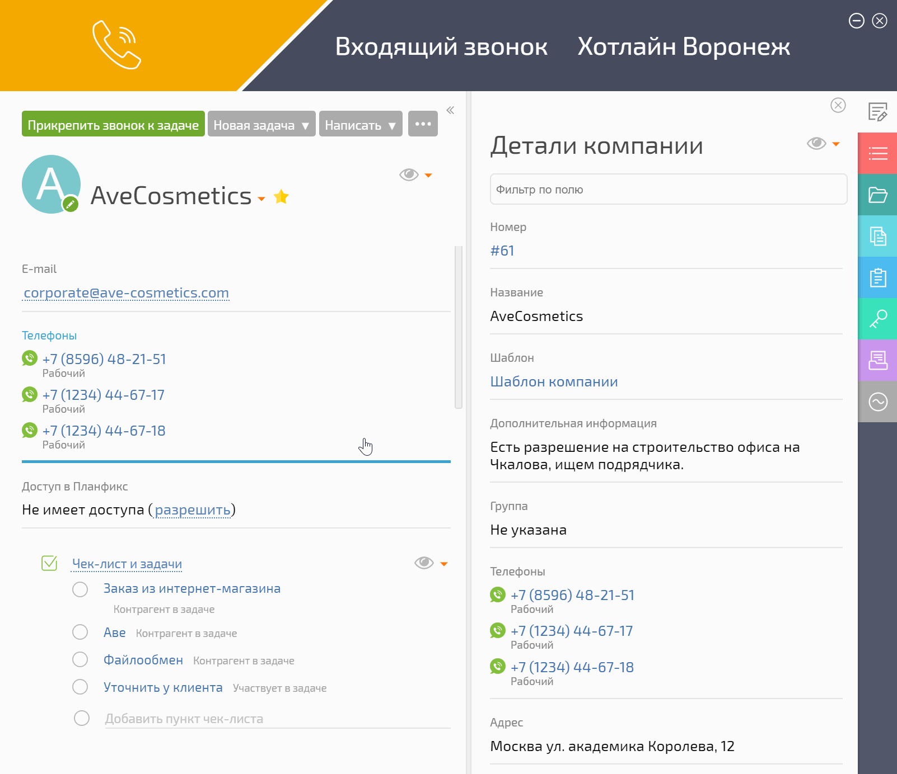

В карточке звонка отображаются карточка контакта: 

  

  

Для управления ими можно в шаблоне контакта вытащить повыше те данные, которые хочется видеть в первую очередь: 

  

  

Данные поля можно редактировать прямо в ходе разговора: 

  

  

## Полезные ссылки

  * [Телефония: Окно звонка 3.0](https://planfix.com/ru/blog/telefoniya-okno-zvonka-3-0/)
