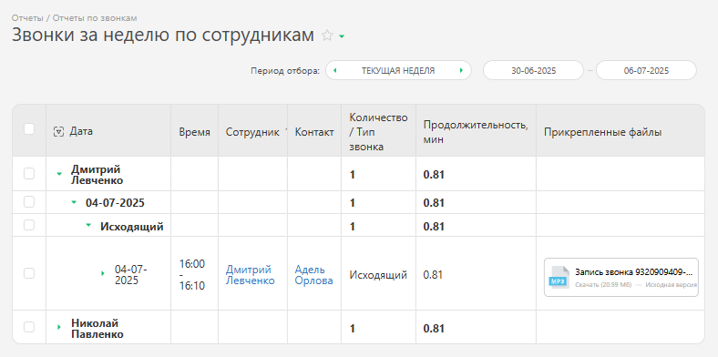

Этот отчет служит для получения сводных данных о количестве и времени звонков за определенный промежуток времени, в разрезе по сотрудникам, их совершившим. Он доступен после подключения интеграции с одной из [виртуальных АТС](Виртуальные_АТС.md "Виртуальные АТС"). 

Для запуска отчета перейдите в раздел "Отчеты" — "Отчеты по звонкам" — "Отчет: Звонки за неделю по сотрудникам": 

