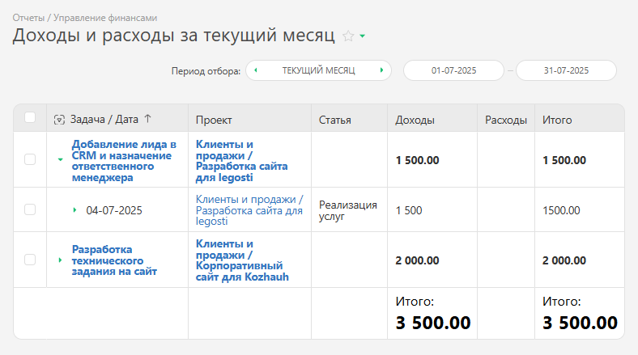

Этот отчет служит для просмотра в удобном виде доходов и расходов по проекту, задаче, сотруднику и другим параметрам. 

Для работы с отчетом: 

  * [ Установите конфигурацию](Конфигурации.md "Конфигурации") "Учет доходов и расходов".

  * Введите данные при помощи [аналитик Доходы и Расходы](Управление_финансами.md "Управление финансами").

  * Перейдите в раздел "Отчеты" — "Финансы" — "Отчет: доходы и расходы" и запустите отчет:

