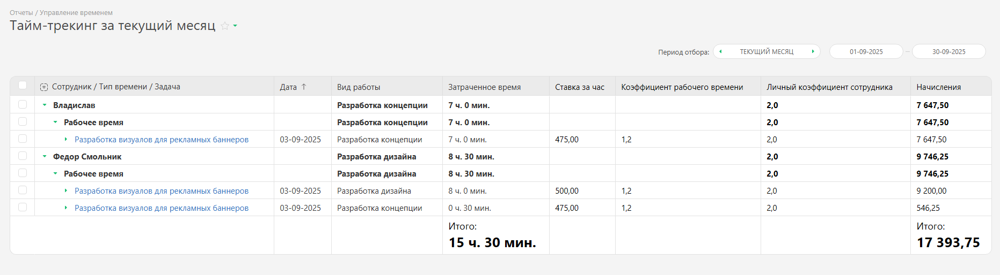

Этот отчет служит для получения сводных данных о времени, затраченном сотрудниками на различные задачи, о видах выполненных работ, а также об оплате за эти работы. 

Для запуска отчета перейдите в раздел "Отчеты" — "Управление временем" — "Отчет: тайм-трекинг": 

