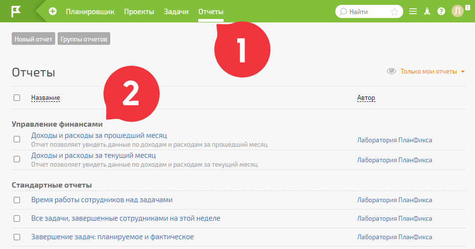
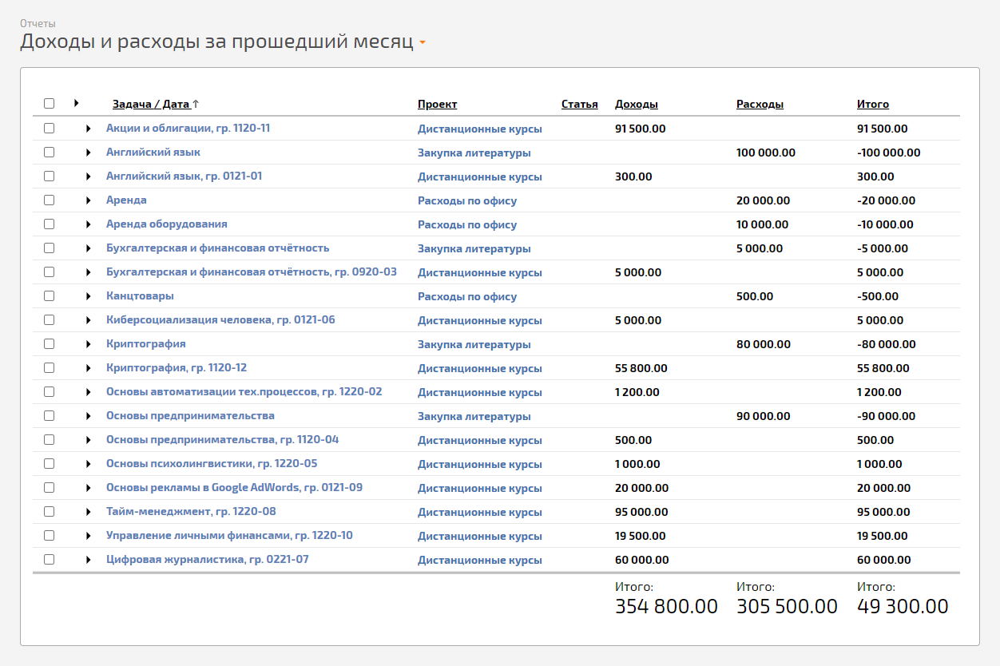
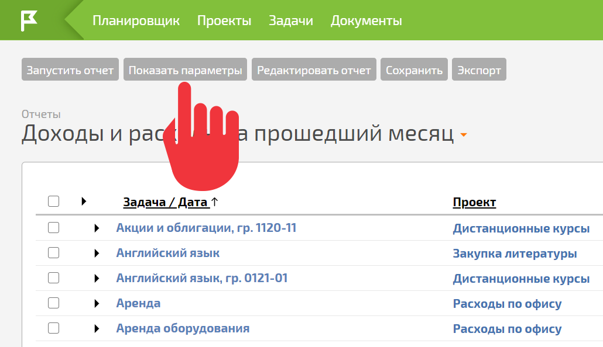

Информация, внесенная в ПланФикс [аналитиками](Аналитика.md "Аналитика") «Доходы» и «Расходы», отображается в соответствующих отчётах: 

  

В отчётах выводятся данные по доходам и расходам в разрезе проектов и задач за текущий и прошлый месяц. По умолчанию в нём отображается информациях из всех незавершенных задач: 

  

Вы можете изменять стандартный отчёт или создавать на его основе другие [отчеты](Отчеты.md "Отчеты"), в которые попадёт информация из этих же аналитик, но отобразится в другом разрезе. Для этого необходимо настроить параметры отбора данных для отчёта: 

