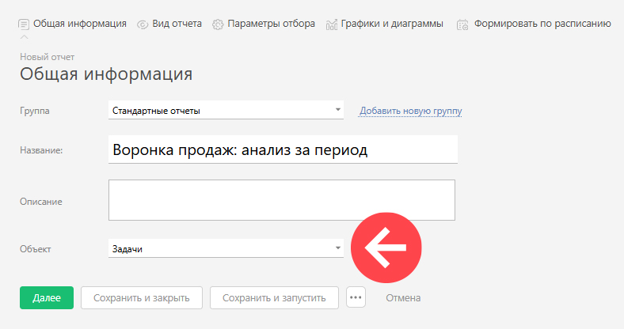
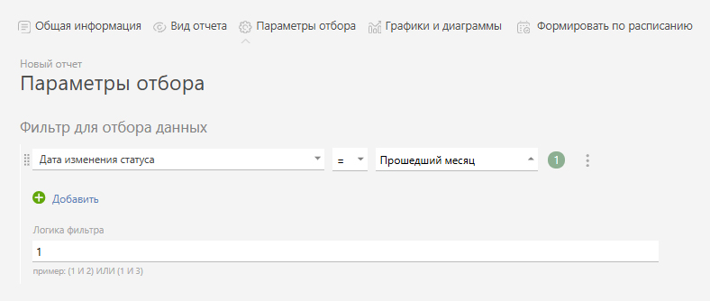

ПланФикс позволяет строить [отчеты](Отчеты.md "Отчеты") по истории [ статусов](Какой_смысл_в_статусах_задач_.md "Какой смысл в статусах задач?"), в которых находилась [ задача](Задачи.md "Задачи"). Эта информация доступна в отчетах, которые строятся по объекту Задача: 

  

На вкладке **Вид отчета** доступны следующие реквизиты истории статусов: 

  * История статусов.**Статус** \- статус, в котором находилась задача.

  * История статусов.**Порядковый номер статуса** \- номер по порядку этого статуса в [наборе статусов](Набор_статусов_Объекта.md "Набор статусов Объекта") Объекта задачи.

  * История статусов.**Следующий статус** \- статус, в который перешла задача.

  * История статусов.**Дата перевода в следующий статус** \- дата и время момента перевода задачи в следующий статус.

  * История статусов.**Время в статусе (общее)** \- время в минутах, которое задача находилась в статусе до перевода.

  * История статусов.**Время в статусе (рабочее)** \- рабочее время исполнителей задачи в минутах, прошедшее в течение времени, которое задача находилась в статусе до перевода.

## Важно

Новая информация в истории статусов появляется в момент перевода задачи в следующий статус. Это необходимо для того, чтобы подсчитать время нахождения задачи в статусе. В связи с этим, **история статусов не содержит информации о текущем статусе задачи**. 

В случае нахождения задачи в статусе менее 1 секунды, данные в отчете по истории статусов не фиксируются. 

Это важно для понимания функционирования отчетов, использующих историю статусов, в частности [ отчетов по воронке продаж за период](Отчеты_в_конфигурации_Управление_сделками.md "Отчеты в конфигурации Управление сделками") из стандартной конфигурации [Управление сделками](Управление_сделками.md "Управление сделками"). 

## Дополнительно

  * Вы можете отбирать данные в отчет по дате перевода в тот или иной статус при помощи такого условия:

