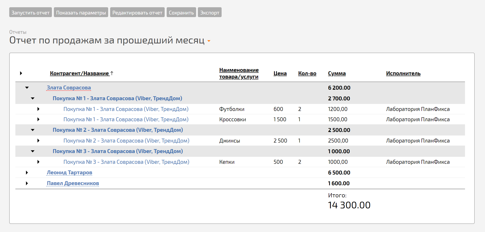
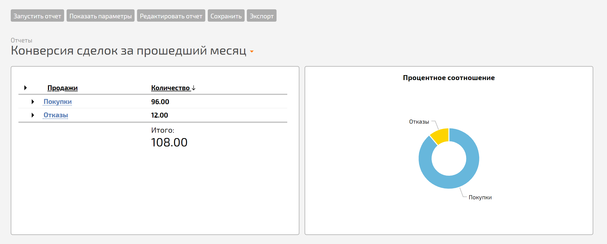
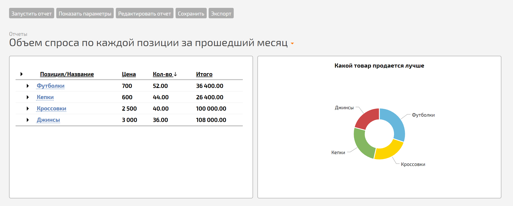
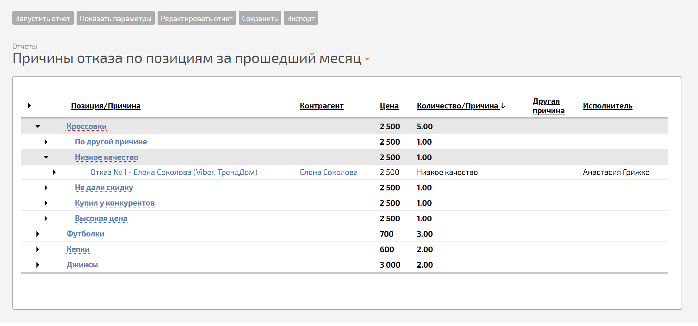
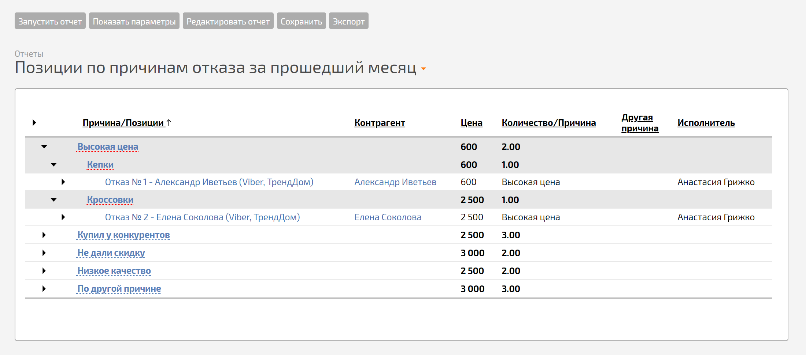
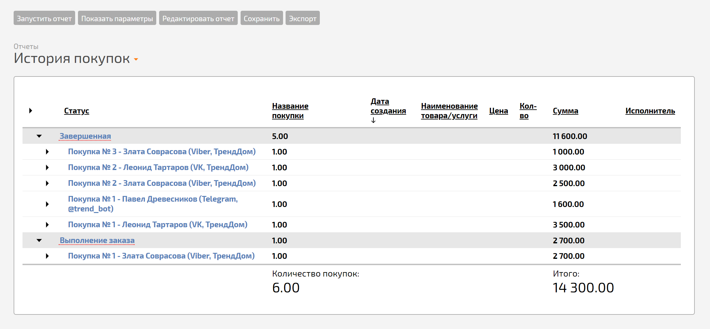
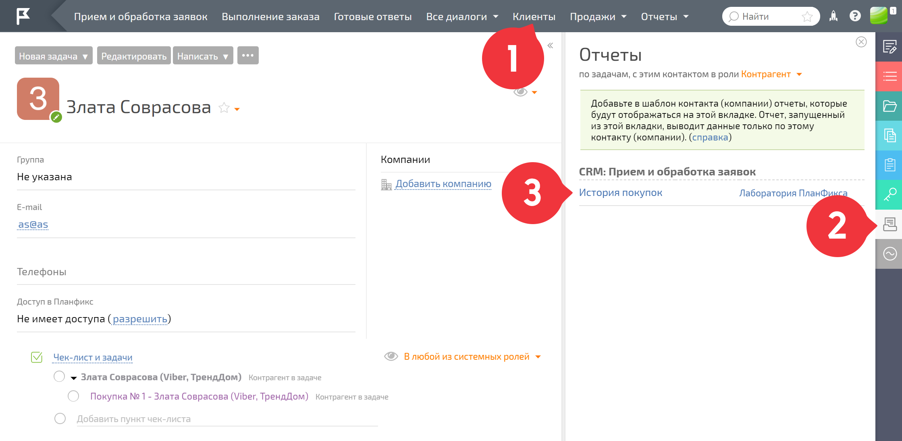
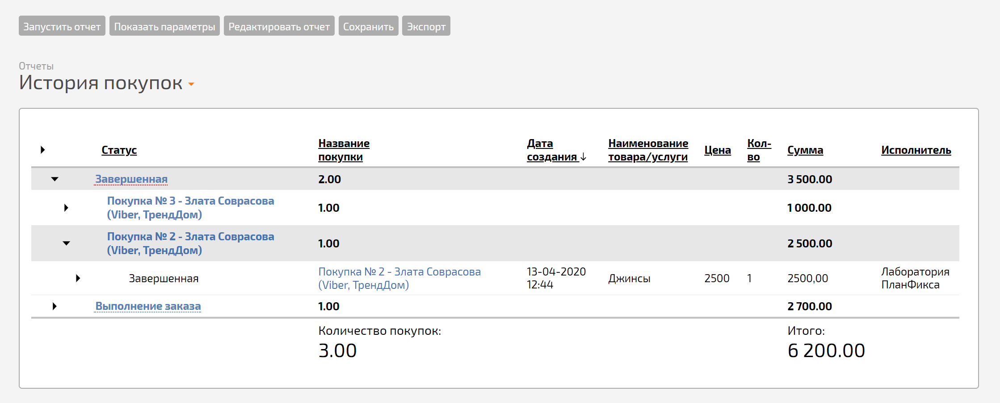

В конфигурацию [ CRM: Прием и обработка заявок](CRM__Прием_и_обработка_заявок.md "CRM: Прием и обработка заявок") добавлены несколько стандартных отчетов. Они позволяют увидеть сводную информацию по запросам за определенный период. Параметры отчетов можно менять: 

  

  * **Отчет по продажам за прошедший месяц** — показывает сумму продаж за месяц в разрезе по каждому клиенту:

  

  * **Конверсия сделок за прошедший месяц** — подсчитывает общее число покупок и отказов, а также показывает их соотношение:

  

  * **Объем спроса по каждой позиции за прошедший месяц** — демонстрирует общее количество продаж по каждой товарной позиции, где можно увидеть, какой товар продается лучше, а какой хуже. Период отбора можно установить любой:

  

  * **Причины отказа по позициям за прошедший месяц** — показывает причины отказа от покупки в разрезе по каждой товарной позиции. Если их много, работу по этой товарной позиции необходимо пересмотреть:

  

  * **Позиции по причинам отказа за прошедший месяц** — группирует товарные позиции с одинаковой причиной отказа. Например, можно увидеть, какие, по мнению покупателей, товары или услуги продаются по высокой цене:

  

  * **История покупок** — отчет показывает историю покупок за все время работы в конфигурации:

  

Историю покупок каждого клиента можно узнать, если запустить отчет из его карточки: 

  

Помимо стандартных отчетов вы можете [ сформировать любой отчет](Как_создать_новый_отчет_.md "Как создать новый отчет?"), который будет учитывать специфические показатели именно вашей компании.
