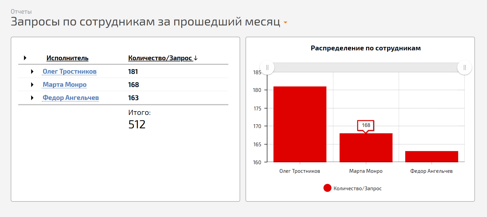
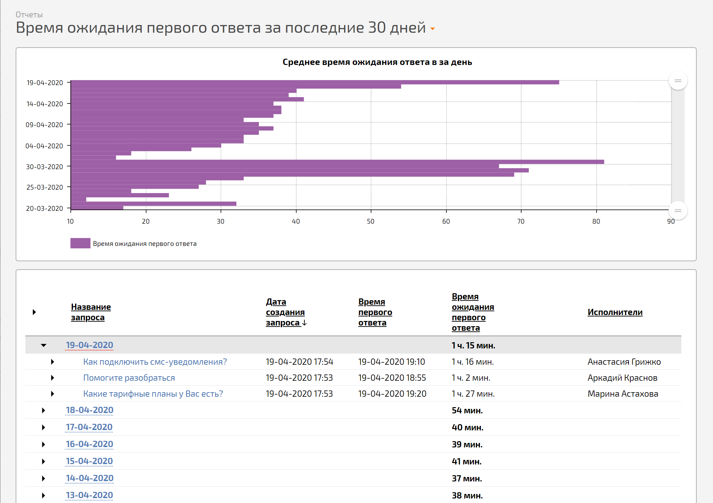
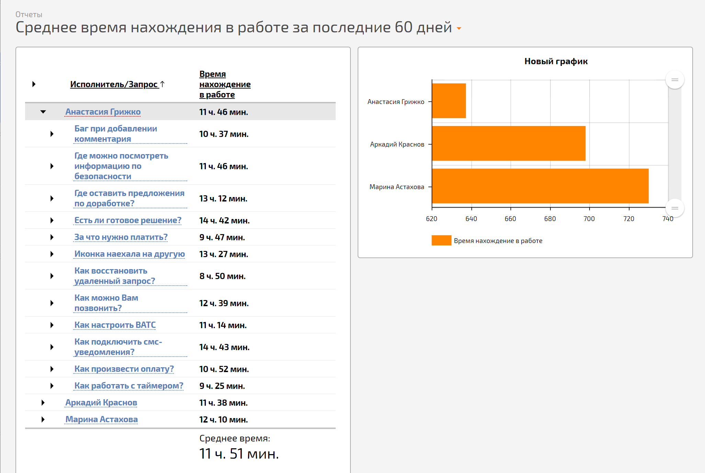
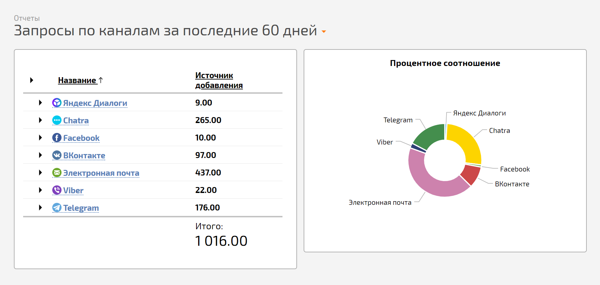
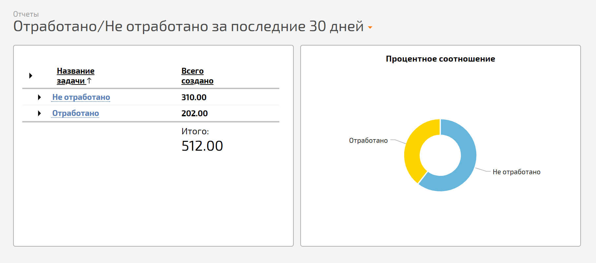

В конфигурацию [ Службы поддержки](Конфигурация_Служба_поддержки.md "Конфигурация Служба поддержки") добавлены несколько стандартных отчетов. Они позволяют увидеть сводную информацию по запросам за определенный период: 

  * **Запросы по сотрудникам за прошедший месяц**. Отчет показывает количество завершенных запросов для каждого сотрудника за прошедший месяц. В нем также ведется подсчет общего количества поступивших обращений в службу поддержки за указанный период.

  

  * **Время ожидания первого ответа за последние 30 дней**. Отчет учитывает время первого ответа каждому клиенту и выводит среднее значение за день по всем сотрудникам. А в итогах отчета можно увидеть среднее время ответа за последние 30 дней — это помогает понять, как долго ваши клиенты ждут ответа от службы поддержки.

  

  * **Среднее время нахождения в работе за последние 60 дней**. Отчет считает общее время нахождения каждого запроса в статусе "В работе", группирует по сотрудникам и выводит средний показатель за последние 60 дней. Так можно выяснить, сколько времени в среднем необходимо каждому сотруднику на обработку запроса. В этом же отчете выводится средний показатель затраченного на работу времени по всем сотрудникам в целом.

  

  * **Запросы по каналам за последние 60 дней**. Отчет подсчитывает общее количество запросов, поступивших по разным каналам связи за последние 60 дней. Здесь же видно, какой канал связи предпочитают ваши клиенты для общения со службой поддержки.

  

  * **Отработано/Не отработано за последние 30 дней**. Отчет считает общее количество запросов, поступивших в службу поддержки за последние 30 дней, и сортирует их по двум признакам: запрос в службу поддержки отработан (т.е. проблема решена) или по нему еще ведется работа. Это позволяет видеть как общую загруженность службы поддержки за последний месяц, так и текущую.

  

На основе стандартных отчетов вы можете [ сформировать любой отчет](Как_создать_новый_отчет_.md "Как создать новый отчет?"), который будет учитывать специфические показатели службы поддержки именно вашей компании.
