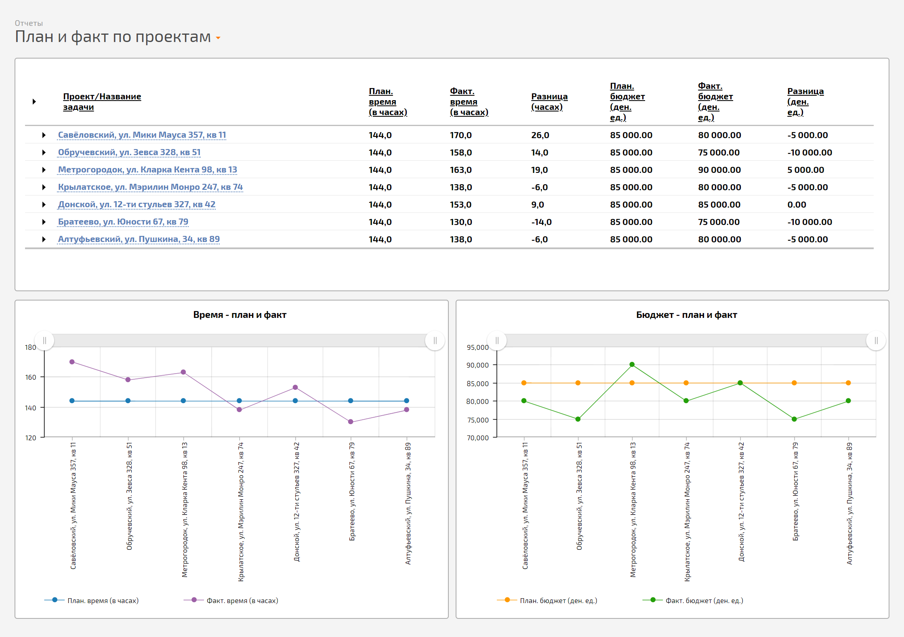
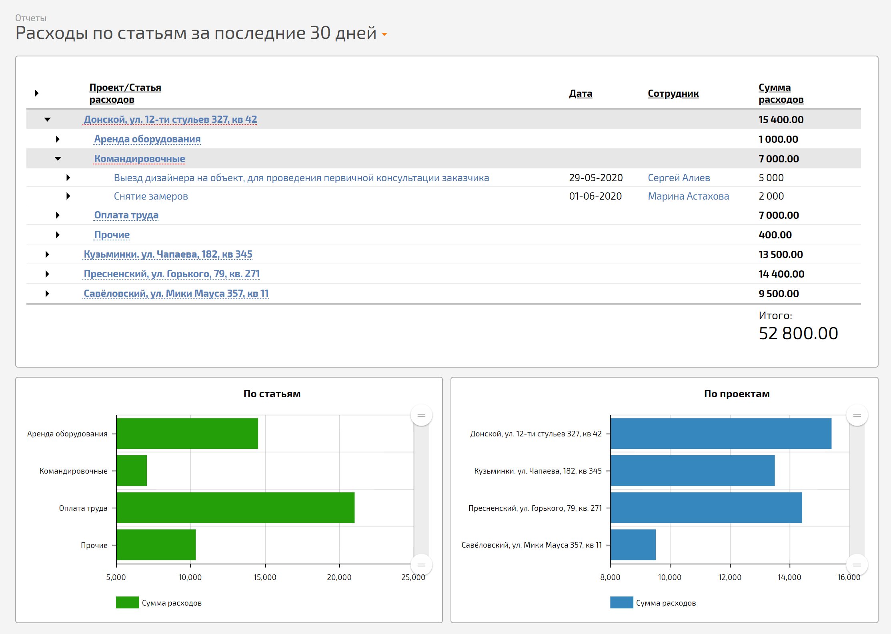
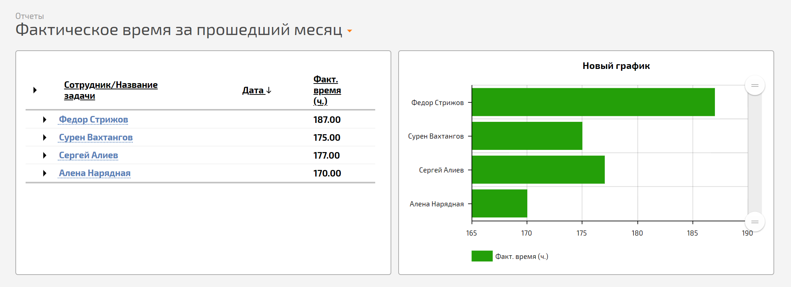
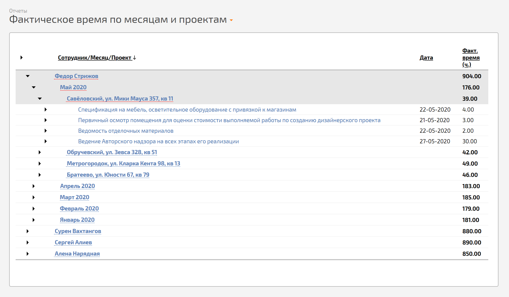

В конфигурацию [ Управление проектами](Конфигурация_Управление_проектами.md "Конфигурация Управление проектами") добавлены несколько стандартных отчетов: 

  * **Прогресс проектов** — отчет демонстрирует степень завершенности задач в проекте в процентном соотношении. В нем также видно на каком этапе выполнения находится проект:

  

  * **План и факт по проектам** — в отчете отображаются сводные данные по планируемым и фактическим затратам времени и бюджета:

  

  * **Расходы по статьям за последние 30 дней** — отчёт демонстрирует расходы, совершенные за последние 30 дней по проектам и статьям:

  

  * **Фактическое время за прошедший месяц** — отчет демонстрирует количество затраченного времени каждого сотрудника на выполнение задач по проектам за прошедший месяц:

  

  * **Фактическое время по месяцам и проектам** — отчет демонстрирует количество затраченного времени на выполнение задач каждым сотрудником в разрезе по месяцам и проектам:

  

На основе стандартных отчетов вы можете [ сформировать любой отчет](Как_создать_новый_отчет_.md "Как создать новый отчет?"), который будет учитывать специфические показатели управления проектами именно в вашей компании.
