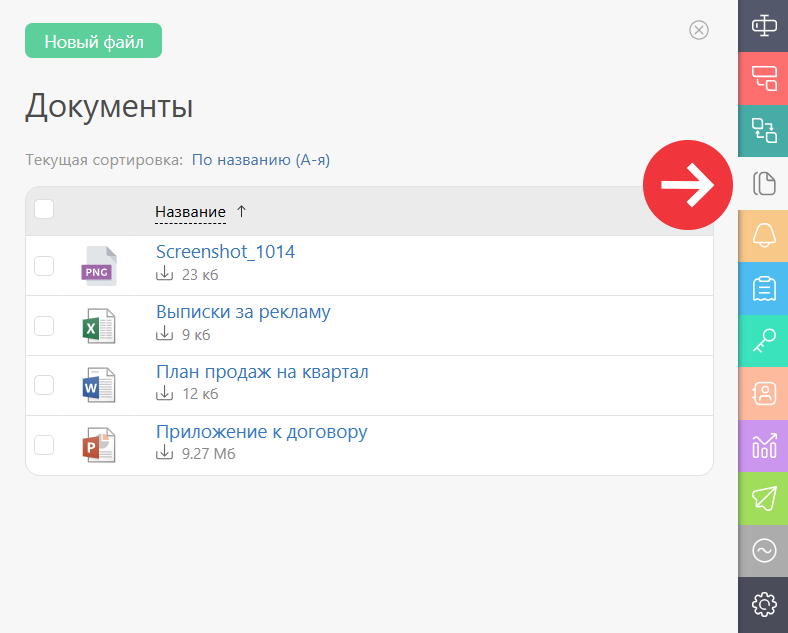
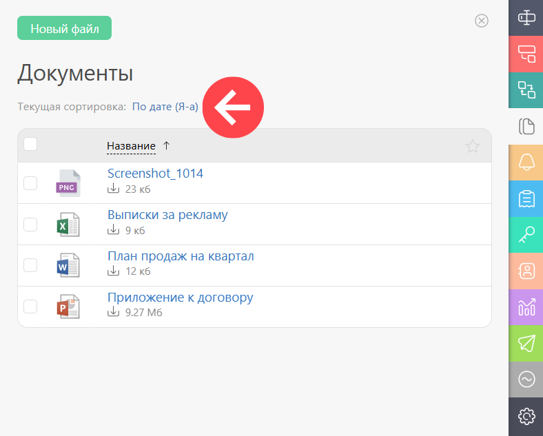
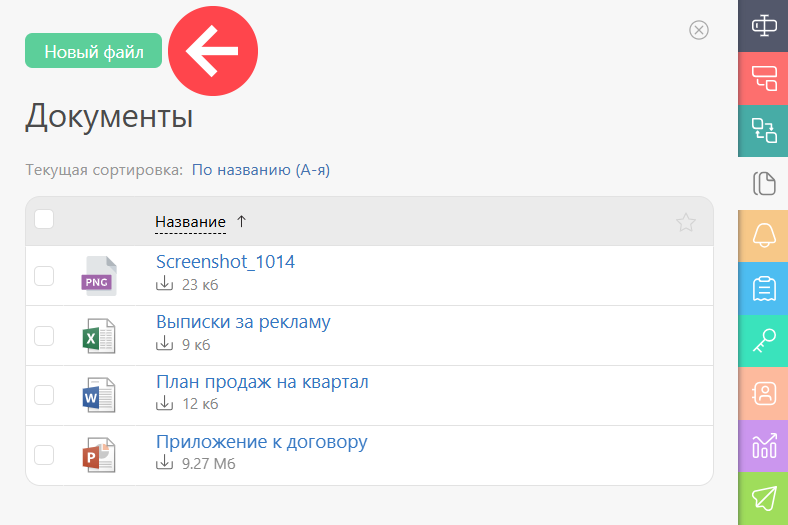
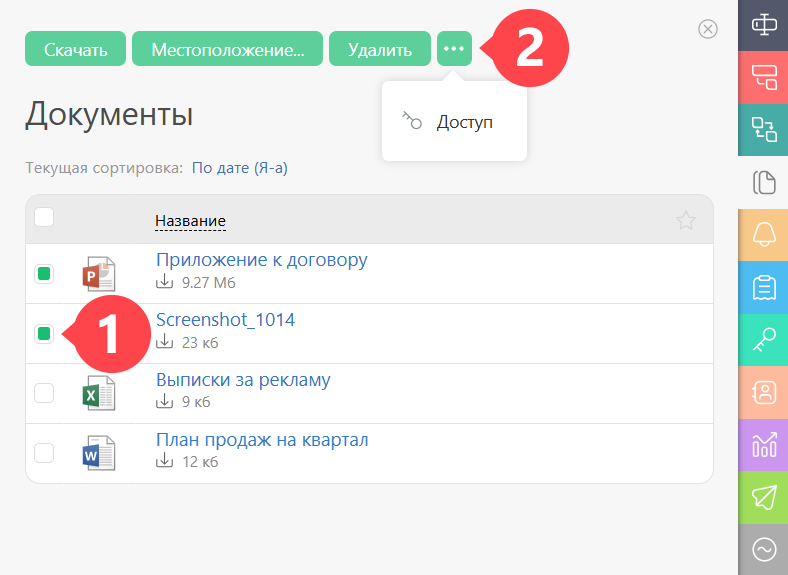
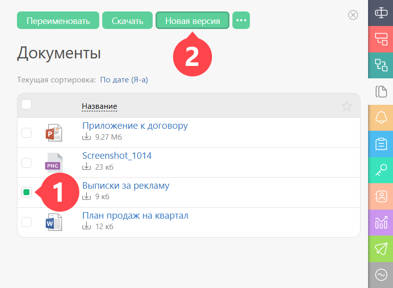

Во вкладке Документы отображаются все [файлы](Файлы.md "Файлы"), прикрепленные к текущей задаче: 

  

Документы в этой вкладке сортируются по одному из признаков: 

  

В этой вкладке можно добавить новые файлы: 

  

Удалить или изменить к ним доступ массовым действием: 

  

При выделении галочкой только одного документа можно добавить его новую версию или переименовать его: 

