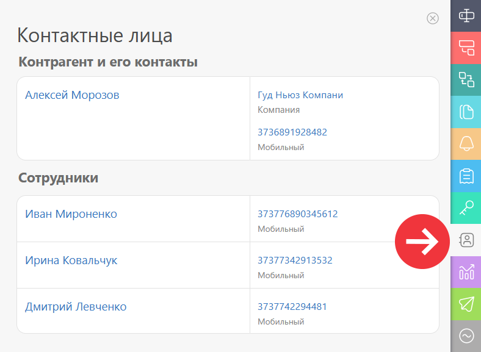
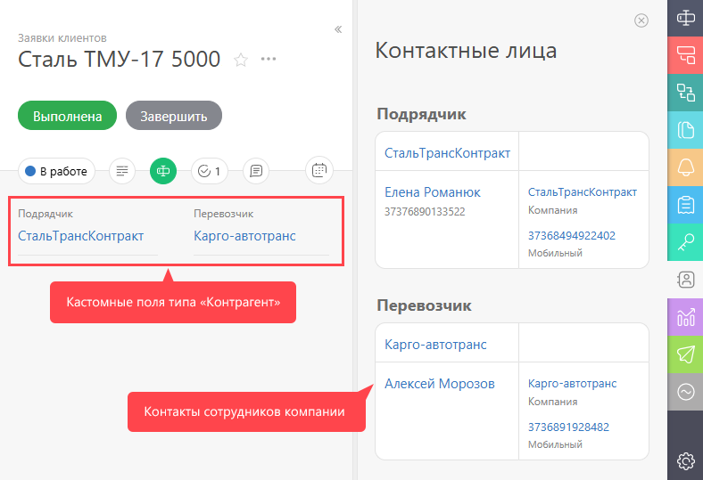

В этой вкладке указываются все контакты пользователей, подключенных в текущей задаче: 

  

Из этой вкладке можно напрямую перейти к карточкам [ контактов](Контакты.md "Контакты") и [ сотрудников](Сотрудники.md "Сотрудники"), а также осуществлять звонки на номера контактов в случае, если подключена интеграция с [ ВАТС](Виртуальные_АТС.md "Виртуальные АТС"). 

  

## Дополнительная информация

  * Если в задаче есть несколько [ полей типа Контрагент](Контрагент_-_Тип_поля.md "Контрагент - Тип поля"), то на вкладке Контакты отображаются контакты сотрудников компаний, указанных в этих полях:

