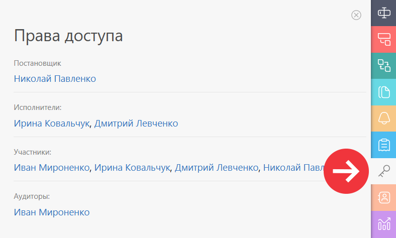

В этой вкладке перечисляются все пользователи, имеющие доступ к задаче, а также основание для этого доступа: их [ роль в задаче](Таблица_прав_доступа_к_задаче_по_ролям.md "Таблица прав доступа к задаче по ролям") или положение в [структуре компании](Структура_компании.md "Структура компании"): 

