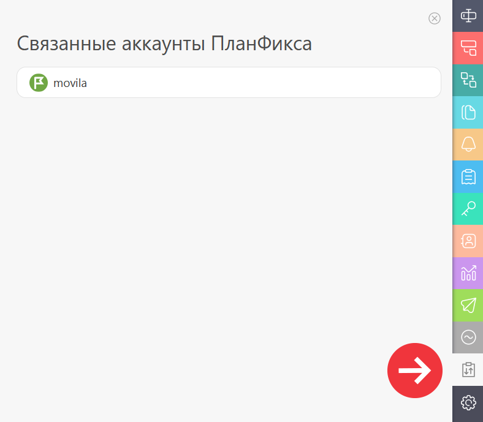
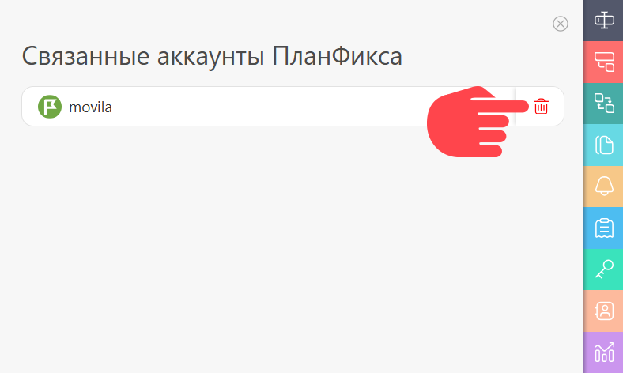

В этой вкладке отображаются аккаунты ПланФикса, которые [ связаны](Как_связать_существующие_аккаунты.md "Как связать существующие аккаунты") с данной задачей: 

  

Здесь можно [ удалить связь](Удаление_связи_между_аккаунтами.md "Удаление связи между аккаунтами"): 

  

После этого сотрудники из связанного аккаунта будут отстранены от [ работы над задачей](Работа_в_связанных_аккаунтах.md "Работа в связанных аккаунтах") в вашем аккаунте, а сотрудники из вашего аккаунта будут отстранены от задачи в связанном аккаунте.
