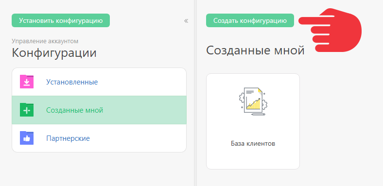
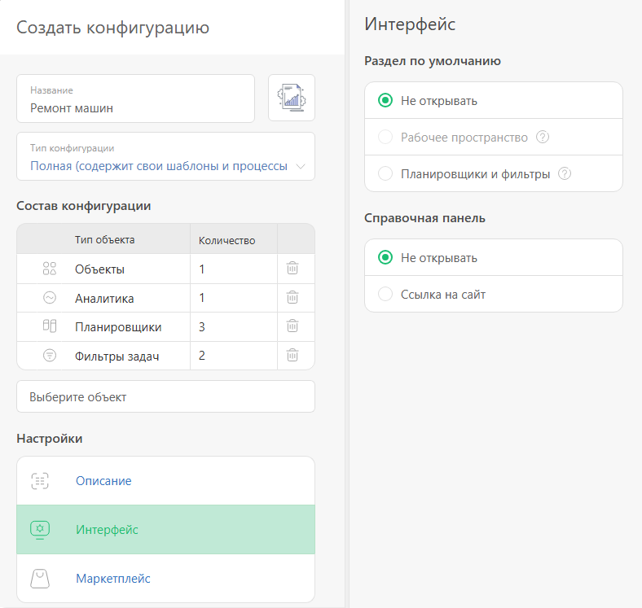

[ Сертифицированные партнеры](Партнерская_программа.md "Партнерская программа") могут создавать свои [конфигурации](Конфигурации.md "Конфигурации") для дальнейшего использования их в аккаунтах клиентов. Конфигурации могут создаваться в любом аккаунте. Для партнеров есть также возможность создания аккаунта специального типа **Партнерская конфигурация**. 

## Аккаунт типа «Партнерская конфигурация»

Для создания конфигурации партнер может зарегистрировать отдельный аккаунт типа **Партнерская конфигурация**. Для этого при регистрации нового аккаунта нужно указать e-mail, зарегистрированный в [ партнерской программе](Партнерская_программа.md "Партнерская программа"), и выбрать соответствующий тип аккаунта, который соответствует следующим параметрам: 

  * Ограничения по функционалу на уровне тарифного плана **Корпорация**

  * Возможность подключить **10 сотрудников специального типа** и **1 контакт с доступом** (используется для целей отладки конфигурации).

Как и в обычном аккаунте, сотрудники подключаются в разделе «Компания». При этом для добавления сотрудника нет необходимости указывать email - достаточно указать имя. Входить такой "сотрудник" в систему тоже не может - войти под ним может только управляющий аккаунтом, используя стандартный [механизм входа под сотрудником](Вход_для_администратора_под_учетной_записью_пользователя.md "Вход для администратора под учетной записью пользователя"). 

Использование отдельного аккаунта для конфигурации удобно тем, что: 

  * В аккаунте содержатся только объекты, входящие в состав конфигурации. Это упрощает работу по ее поддержанию.

  * Вход под сотрудниками с разными ролями позволяет протестировать работу конфигурации в разных сценариях, а также подготовить наглядные демонстрационные материалы - скриншоты, видео и т.п. - для каждой из ролей, используемых в конфигурации.

  * Аккаунт этого типа не замораживается и не удаляется, соответственно нет необходимости поддерживать в нем активность для предотвращения потери конфигурации.

**Важно:** аккаунт типа "Партнерская конфигурация" запрещено использовать для целей, отличных от создания и поддержания конфигурации. 

## Создание партнерской конфигурации

  * Конфигурацию можно создать в разделе **Управление аккаунтом** — **Конфигурации** — **Созданные мной** — **Создать конфигурацию** :

  

  * Создание конфигурации заключается в выборе сущностей, которые должны в нее войти:

  

  * Все, что выбрано в этом интерфейсе, будет запаковано в конфигурацию и станет доступно для установки в любом другом аккаунте, в который партнер входит под своим email.

  * Все созданные конфигурации находятся в разделе **Управление аккаунтом** — **Конфигурации** — **Партнерские**.

  * Партнер может опубликовать свою конфигурацию в разделе [Готовые решения](https://planfix.ru/configurations/) на сайте ПланФикса. Для этого в процессе создания конфигурации необходимо заполнить все поля в разделе **Настройки** и отправить ее на модерацию.

## Дополнительная информация

В партнёрскую конфигурацию можно добавить другого партнёра (партнёров) в качестве сотрудников. В отличие от других сотрудников в таком аккаунте, ему будет отправлено приглашение, и он сможет входить в аккаунт. 

Особенности работы партнёров в аккаунте: 

  * Партнёрские конфигурации управляющего аккаунтом видит только управляющий.

  * Все партнёры могут видеть конфигурации друг друга, которые они создали в этом аккаунте, и могут их редактировать.

  * Никто из партнёров не видит конфигурации друг друга, созданные ими в других аккаунтах.

  * Конфигурация остается привязанной к тому партнёру, который её создал изначально.
