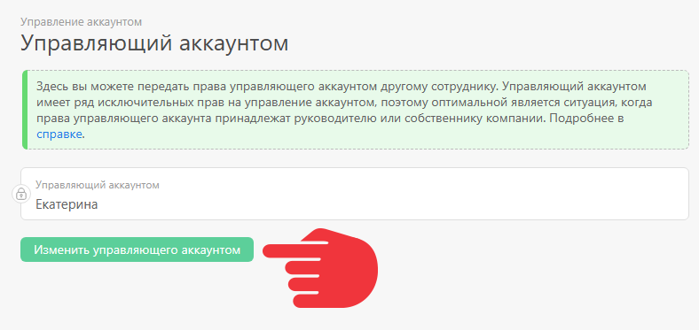

[Управляющий аккаунтом](Управляющий_аккаунтом.md "Управляющий аккаунтом") в ПланФиксе может передать права другому [ сотруднику](Сотрудники.md "Сотрудники") аккаунта. 

Для этого пройдите по пути: 

  * Нажать на аватар — **Управление аккаунтом** — **Управляющий аккаунтом** :

  * Кликнуть на **Изменить управляющего аккаунтом** возле имени текущего управляющего:

  

  * выбрать нового управляющего и нажать **Сохранить**.

## Важно

  * При предоставлении прав управляющего новый управляющий автоматически становится администратором аккаунта.

  * Для передачи прав управляющий аккаунтом должен обладать правами администратора аккаунта.

  * Права управляющего аккаунтом можно передать только сотруднику. При необходимости передать права [ контакту](Контакты.md "Контакты"), необходимо сначала сделать его сотрудником.
