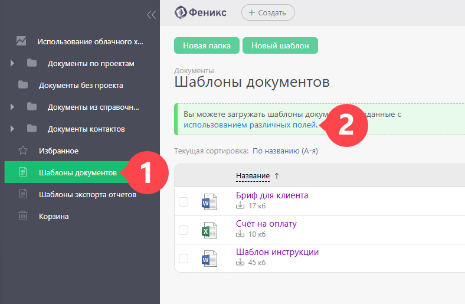
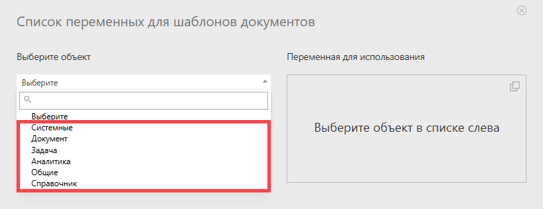
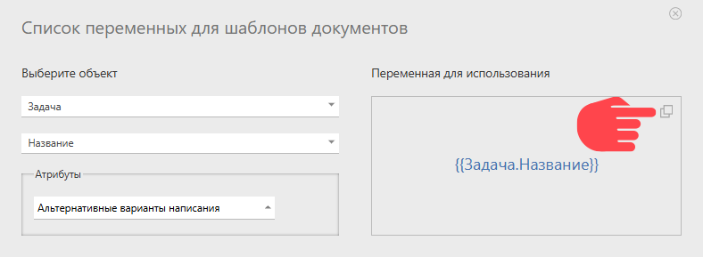
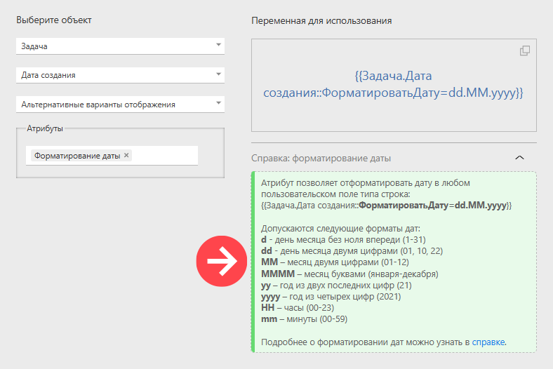

В [ шаблонах документов](Шаблоны_документов.md "Шаблоны документов") активно используются **переменные**. При формировании документа по шаблону, вместо переменных подставляются значения, хранящиеся в объекте, с которым она связана. Именно это и делает шаблоны документов удобным средством быстрого формирования документов нужной формы, наполненных данными конкретного контакта, задачи или аналитики. 

Помимо переменных, [использующихся в шаблонах задач](Переменные_в_шаблонах_задач.md "Переменные в шаблонах задач"), в шаблонах документов доступны дополнительные переменные. Полный список доступных переменных можно получить в разделе Документы — Шаблоны документов: 

  

  * В левой части окна, которое откроется по этой ссылке, отображается список доступных объектов:

  

  * После выбора нужного объекта, в правой части окна можно увидеть соответствующую ему переменную и скопировать ее для вставки в шаблон документа:

  

  * Для некоторых переменных доступно дополнительное форматирование. В таких случаях прямо под названием переменной отображается информация об этом:

  

  * Представление числа так же можно форматировать, информацию о вариантах форматирования можно прочитать под названием переменной.

## Важно

Все переменные, использующиеся в шаблонах документов, можно разделить на две большие группы в зависимости от их поведения при формировании документа по шаблону: 

  * Обычные переменные.

  * Переменные, приводящие к [ автоматическому размножению строк](Автоматическое_размножение_строк_документа.md "Автоматическое размножение строк документа") в итоговом документе.

## Кодирование переменных

К переменным в ПланФиксе можно применять различные [ функции](Кодирование_переменных.md "Кодирование переменных"). 

## Переменные

Для некоторых переменных написана отдельная справка для лучшего понимания их работы. 

  * [Переменная форматирования текста в шаблонах документов MS Word](Переменная_форматирования_текста_в_шаблонах_документов_MS_Word.md "Переменная форматирования текста в шаблонах документов MS Word")

  * [Выбор формата вывода итогов аналитики](Выбор_формата_вывода_итогов_аналитики.md "Выбор формата вывода итогов аналитики")

  * [Форматирование даты](Форматирование_даты.md "Форматирование даты")

  * [Написание числа прописью](Написание_числа_прописью.md "Написание числа прописью")

  * [ Формулы в шаблонах документов](Функции_в_шаблонах_документов.md "Функции в шаблонах документов")

  * [Специальные переменные списков](Специальные_переменные_списков.md "Специальные переменные списков")

## Полезно

  * С работой переменных в шаблонах документов можно ознакомиться в стандартной конфигурации [Выставление счетов](Выставление_счетов.md "Выставление счетов").
