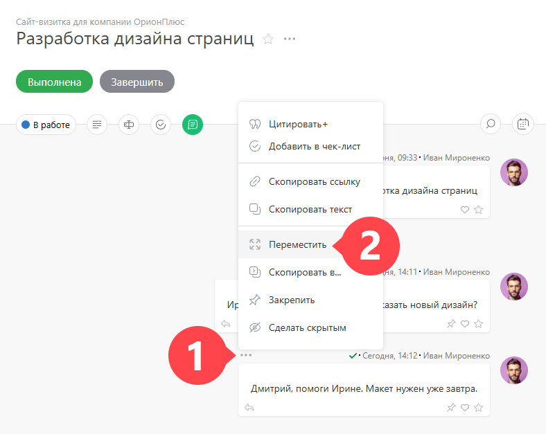
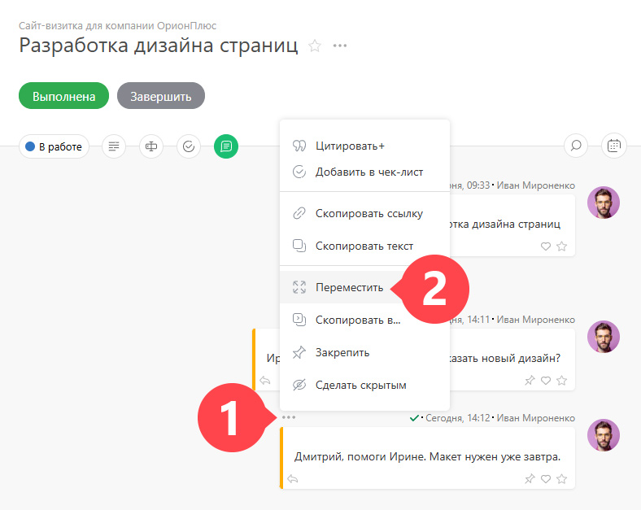

Добавленные к задаче [ комментарии](Действия__(комментарии_.md) "Действия \(комментарии\)") можно перемещать или копировать в другие задачи. Для этого откройте контекстное меню комментария и выберите соответствующий пункт: 

 _Изображение может отличаться в зависимости от выбранного[вида отображения](Лента_комментариев_задачи.md "Лента комментариев задачи") комментариев._

  * **Переместить** — комментарий удалится из текущей задачи и добавится в другую.

  * **Копировать** — комментарий скопируется в другу задачу без удаления из текущей.

  

## Массовые операции над комментариями

Переместить или скопировать можно сразу несколько комментариев: 

  * Выделите несколько комментариев:

  * Выберите нужное действие:

  

  * Переместите все выделенные комментарии:

