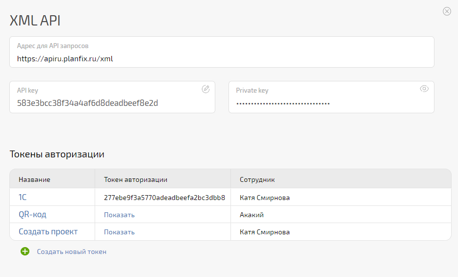
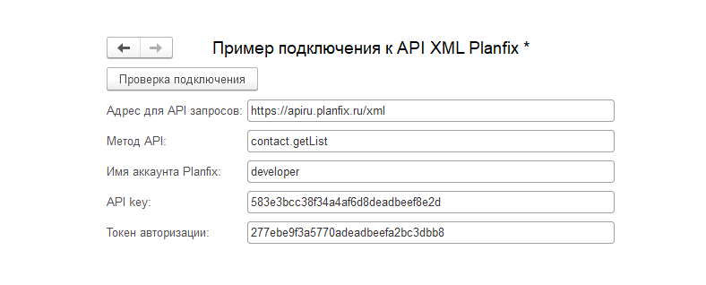

Приведем пару простых примеров для иллюстрации работы с ПланФикс API. 

Создайте токен авторизации по пути **Управление аккаунтом** — **Доступ к API** — **XML API** : 

  

**APIKey** = 583e3bcc38f34a4af6d8deadbeef8e2d 

**Токен** = 277ebe9f3a5770adeadbeefa2bc3dbb8 

**Адрес для API запросов** = https://apiru.planfix.ru/xml 

  

## Получение списка контактов

Пример для получения первой страницы в 10 контактов. 

    

    

    	АдресСервера = "apiru.planfix.ru";

    	Ресурс = "/xml";

    	ИмяПользователя = "583e3bcc38f34a4af6d8deadbeef8e2d";

    	Пароль = "277ebe9f3a5770adeadbeefa2bc3dbb8";

    	СтрокаXML = "<request method=""contact.getList"">"

    	 				+ "<account>testo</account>"

    					+ "<pageCurrent>1</pageCurrent>"

    					+ "<pageSize>10</pageSize>"

    				+ "</request>"; 

    	

    	СтрокаBase64 = ПолучитьBase64СтрокуИзДвоичныхДанных(ПолучитьДвоичныеДанныеИзСтроки("" + ИмяПользователя + ":" + Пароль, КодировкаТекста.UTF8, Ложь));

    	СтрокаBase64 = СтрЗаменить(СтрокаBase64, Символы.ПС, "");

    	СтрокаBase64 = СтрЗаменить(СтрокаBase64, Символы.ВК, "");

    	

    	SSL = Новый ЗащищенноеСоединениеOpenSSL;

    	

    	Соединение = Новый HTTPСоединение(АдресСервера,,,,,,SSL);

    	

    	Заголовки = Новый Соответствие;

    	Заголовки.Вставить("Content-Type", "application/xml; charset=utf-8"); 

    	Заголовки.Вставить("Authorization", "Basic " + СтрокаBase64); 

    	

    	Запрос = Новый HTTPЗапрос(Ресурс, Заголовки);

    	Запрос.УстановитьТелоИзСтроки(СтрокаXML, "UTF-8", ИспользованиеByteOrderMark.НеИспользовать);

    	

    	ОтветОтСервера = Соединение.ОтправитьДляОбработки(Запрос);

    	Сообщить(ОтветОтСервера.ПолучитьТелоКакСтроку("UTF-8"));

  

Пример файла внешней обработки с подключением к XML API ПланФикса — [скачать](https://p.pfx.so/pf/l0/BuU9kx.epf): 

