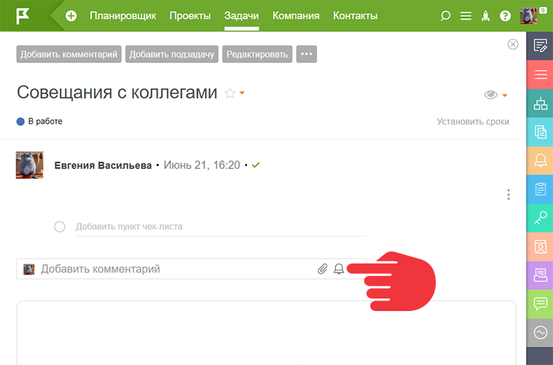
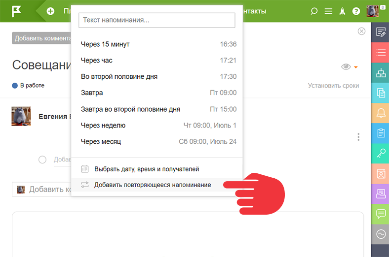
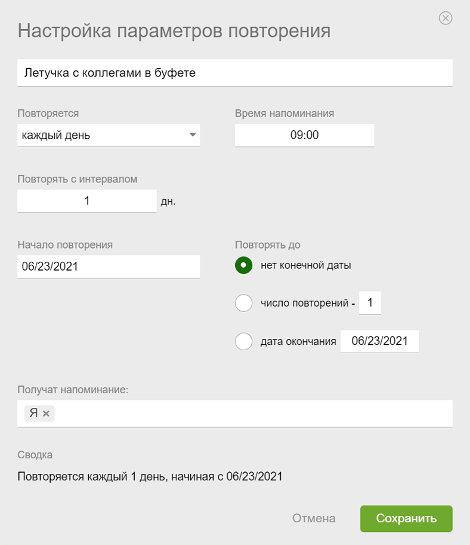
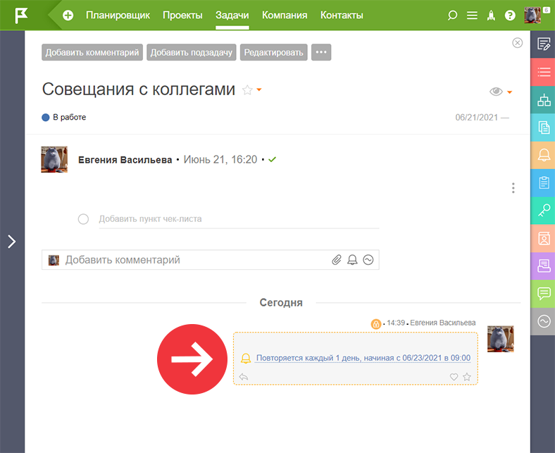
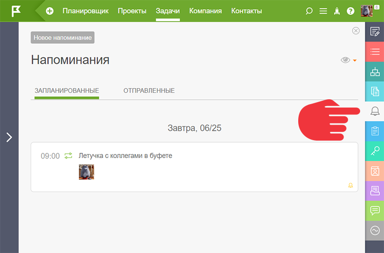

**Повторяющиеся напоминания** — это напоминания, которые вы настраиваете в одной задаче. В момент повторения приходит уведомление согласно выбранных [ настроек уведомлений](Подписки_и_уведомления.md "Подписки и уведомления"). 

## Настройка повторяющегося напоминания

  * Открываете меню настройки обычного напоминания:

  

  * Панель настроек тоже выглядит так:

  

  * Настроенное напоминание выглядит следующим образом:

  

  * Просмотреть запланированные и отправленные повторяющиеся напоминания можно во вкладке «Напоминания» задачи:

  

## Дополнительно

  * Блог: [Повторяющиеся напоминания](https://planfix.com/ru/blog/povtoryayushchiesya-napominaniya/)
