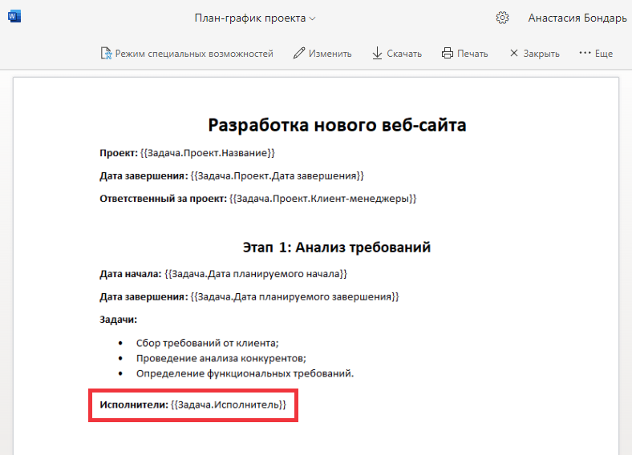
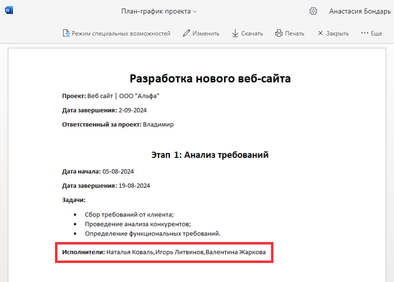
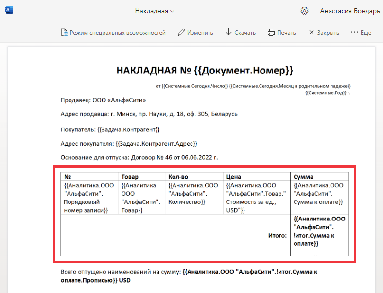
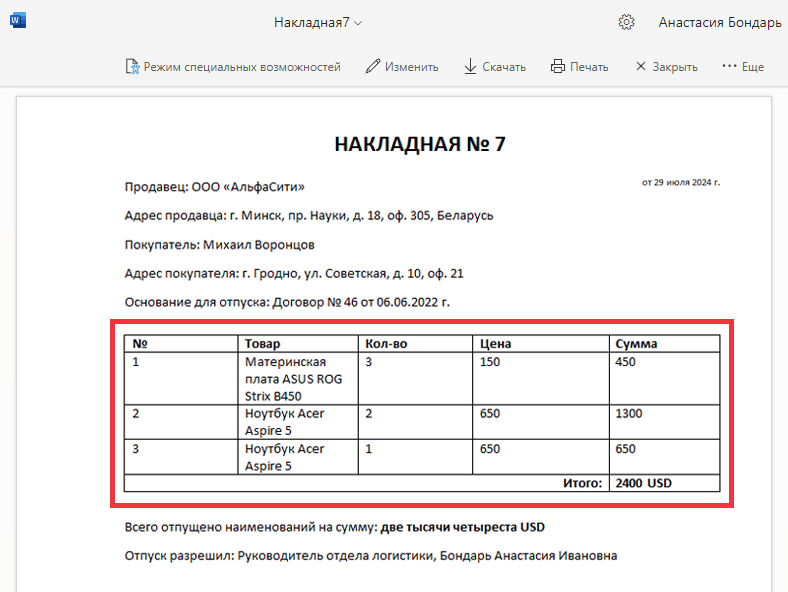
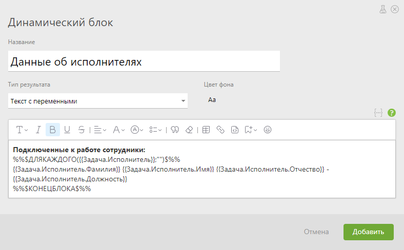
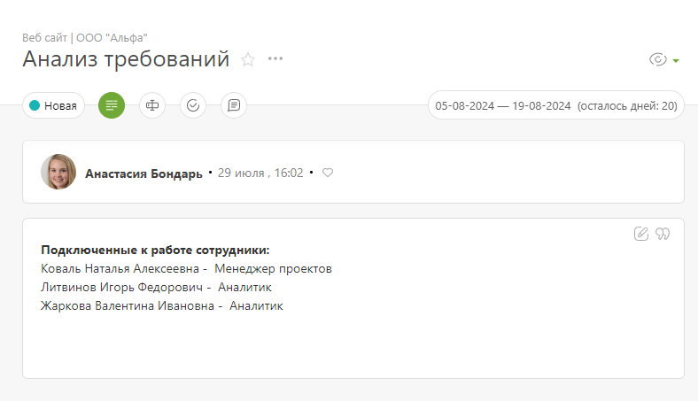
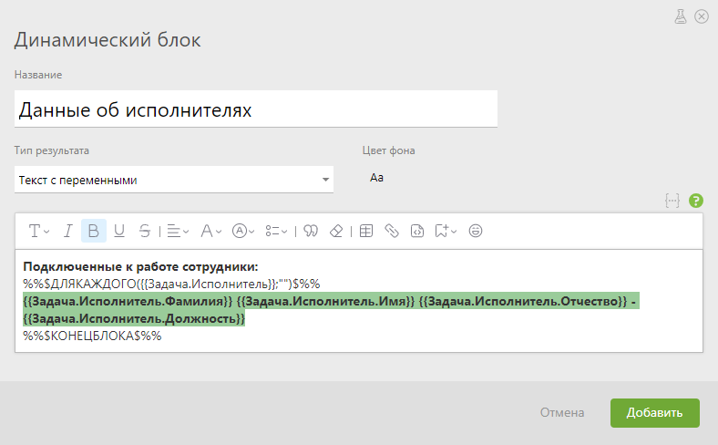
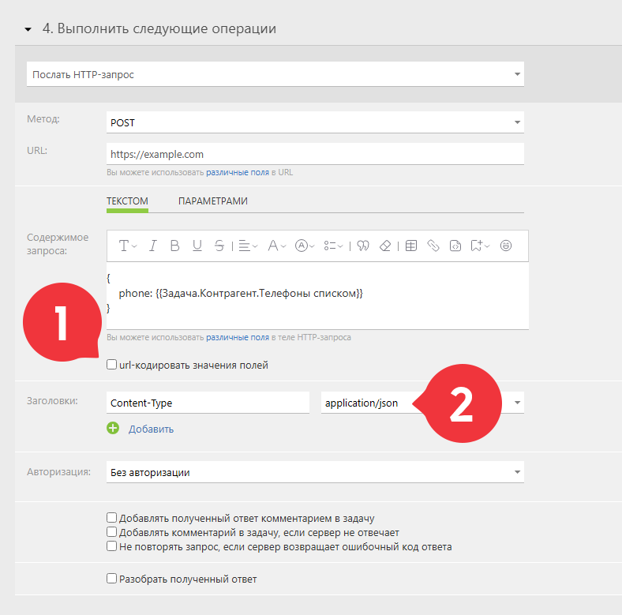

**Повторяющиеся (множащиеся) переменные** — это переменные, которые используются для работы с полями, содержащими несколько значений (исполнители, файлы и т.д.). Они позволяют автоматически выводить данные из этих полей в шаблоны документов, текст с переменными, вычисляемые поля, создавая строки для каждого значения или объединяя их в одну строку через запятую. 

К полям содержащим наборы значений в задачах, контактах, проектах, сотрудниках относятся: 

## Системные поля

Поле | Переменная   

---|---  

Исполнители | {{Задача.Исполнитель}}   

Участники | {{Задача.Участник}}   

Аудиторы | {{Задача.Аудитор задачи}}   

Аналитика | {{Аналитика.Фактическое время работы}}   

Файлы | {{Задача.Прикрепленные файлы}}  

{{Задача.Файл задачи}}  

{{Задача.Все файлы задачи}}   

  

## Пользовательские поля

  * Список

  * Набор задач

  * Набор значений справочника

  * Список пользователей

  * Набор значений

  * Файлы

## Значения переменной в одну строку

Если использовать повторяющуюся переменную в Word или тексте с переменными, то все значения поля будут перечислены в одну строку через запятую. Вот так переменная выглядит в шаблоне: 

  

А вот так в сформированном документе: 

  

## Значения переменной с новой строки

Повторяющиеся переменные в Excel или таблице в Word автоматически размножают строки и выводят все значения, входящие в поле. 

Вот так выглядят переменные в шаблоне документа: 

  

Вот так переменные развернулись в автоматически сформированном документе: 

  

## Дополнительно

Для более сложного отображения данных в тексте с переменными можно использовать конструкции ДЛЯКАЖДОГО или ТАБЛИЦА. 

Например, ДЛЯКАЖДОГО с повторяющейся переменной в динамическом блоке: 

  

После сохранения блока данные отобразятся в виде столбца: 

## Важно

  * В конструкциях ДЛЯКАЖДОГО и ТАБЛИЦА первым аргументом необходимо указывать название поля, по которому нужно произвести итерацию:

  

  * Внутри текста каждой из конструкций необходимо добавить имя переменной с указанием поля, из которого нужно вывести данные:

  

## Переменная и JSON в POST-запросах

Для запроса в формате JSON повторяющаяся переменная представляется как массив данных: 

  

Запрос сформирует валидный JSON: 

    

    

    {

    	phone: [

    		"1 (234) 567-89-01",

    		"2 (345) 678-91-23",

    		"+5 (6789) 12-34-56"

    	]

    }

    

  

Если ожидаются данные в виде одной строки, тогда используйте переменную Телефоны строкой: 

    

    

    {

        phone: "{{Задача.Контрагент.Телефоны строкой}}"

    }

    

  

Результат: 

    

    

    {

    	phone: "1 (234) 567-89-01,2 (345) 678-91-23,+5 (6789) 12-34-56"

    }
