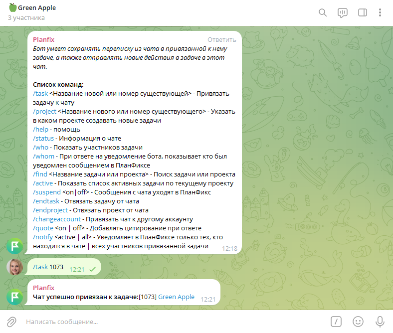
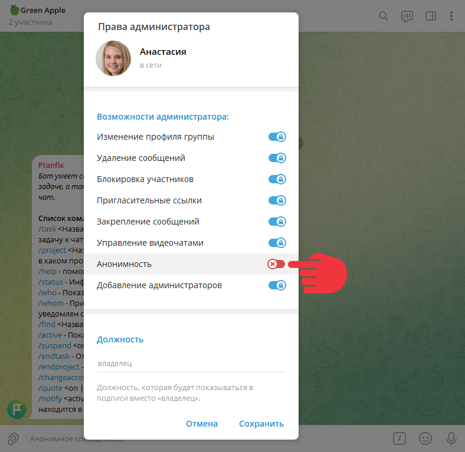
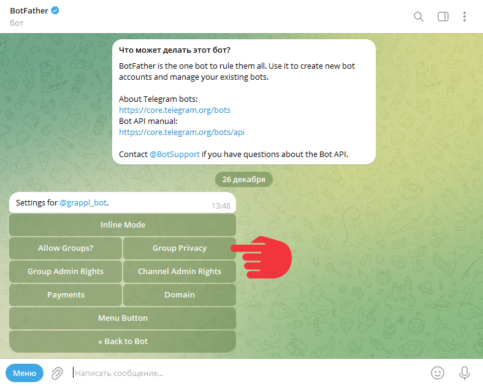

ПланФикс можно подключить к группе [Telegram](Telegram.md "Telegram"), чтобы получать из нее сообщения и отвечать на них. 

## Возможности

  * **Работа в одном окне**. Получайте все сообщения из Telegram-группы в ПланФикс и отвечайте на них прямо из сервиса.

  * **Автоматизация процесса**. Сообщения из группы автоматически попадают в привязанную к ней задачу в ПланФиксе.

  * **Расширение возможностей**. Используйте дополнительные функции собственного бота в группе, чтобы облегчить работу с задачами, клиентами или сотрудниками.

## Подключение

  * [ Авторизуйте Telegram в ПланФиксе](Авторизация_Telegram_в_ПланФиксе.md "Авторизация Telegram в ПланФиксе").

  * Добавьте в группу [ бота ПланФикса](Работа_с_ботом_ПланФикса_для_Telegram.md "Работа с ботом ПланФикса для Telegram") или [собственного бота](Как_создать_собственного_бота_Telegram.md "Как создать собственного бота Telegram").

  * Привяжите Telegram-группу к задаче в ПланФиксе: 

    * Создайте в ПланФиксе задачу или используйте существующую.

    * В Телеграм-группе напишите команду боту ПланФикса: /task <Название новой задачи> или номер существующей задачи без знаков <>.

    * После привязки задачи к Телеграм-группе новые сообщения, поступающие в задачу, будут транслироваться в группу, а сообщения из группы будут транслироваться в задачу:

## Дополнительные настройки

  * Подключение бота в Телеграме невозможно в анонимном режиме. Перед активацией бота выключите анонимный режим в настройках Телеграм-группы: **Администраторы** — **Анонимность** :

  

  * При использовании собственного бота в группе, отключите у него GroupPrivacy в BotFather:

## Ограничения

  * При использовании интеграции есть ряд ограничений. Они описаны в основной статье про [ интеграцию с Телеграм](Telegram.md "Telegram").

  * На текущий момент Telegram не разрешает стороннему сервису первым начинать личную переписку с пользователями. Поэтому если вы хотите ответить человеку, написавшему в группе, личным сообщением, его придется написать в самом Телеграме.
