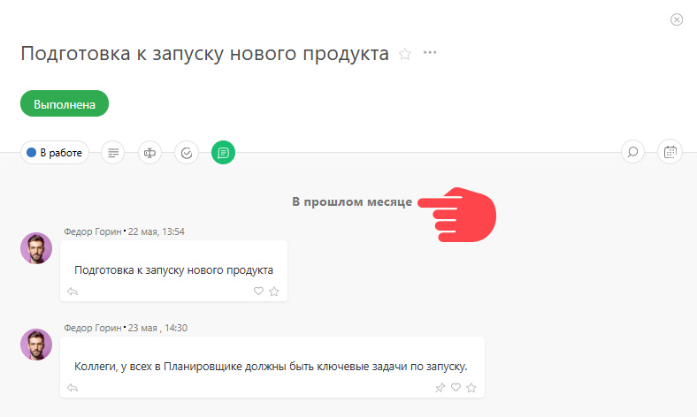
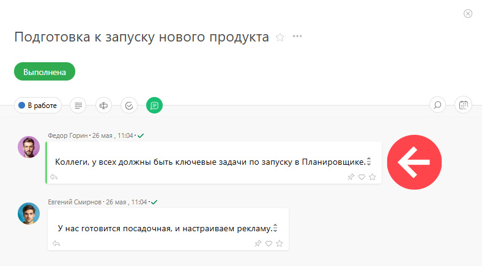
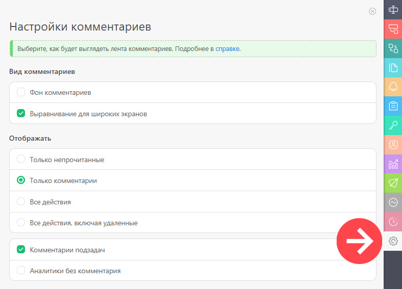

Вы можете найти нужный [комментарий](Комментарии.md "Комментарии") за определённую дату: 

  * Кликните по заголовку даты:

  

  * В появившемся календаре выберите нужную дату.

  * ПланФикс отобразит первый комментарий задачи, время которого совпадает или позже выбранной даты:

  

## Важно

  * Поиск по дате работает только среди тех комментариев, которые заданы в карточке задачи [настройками отображения](Настройка_вида_отображения_карточки_задачи.md "Настройка вида отображения карточки задачи"):

