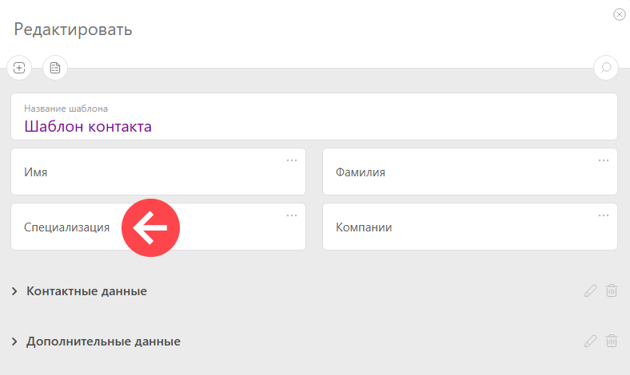

Создание [ пользовательских полей](Пользовательские_поля.md "Пользовательские поля") контактов происходит двумя способами: 

  * в разделе **Управление аккаунтом** — **Настраиваемые поля** — **Поля контактов** — по кнопке **Новое поле** : 

    * При создании поля можно сразу выбрать, в каком [наборе](Наборы_пользовательских_полей.md "Наборы пользовательских полей") оно будет создано.

    * При необходимости новое поле можно перенести на нужную панель.

    * После создания поля, оно будет отображаться в [ шаблонах контактов](Шаблоны_контактов.md "Шаблоны контактов") следующим образом:

  

Если необходимо, можно задать особые [права доступа](Доступ_к_пользовательским_полям.md "Доступ к пользовательским полям") к пользовательскому полю: 

  * в [режиме редактирования](Как_добавить_новое_поле_в_карточку_контакта.md "Как добавить новое поле в карточку контакта") шаблона контакта.
