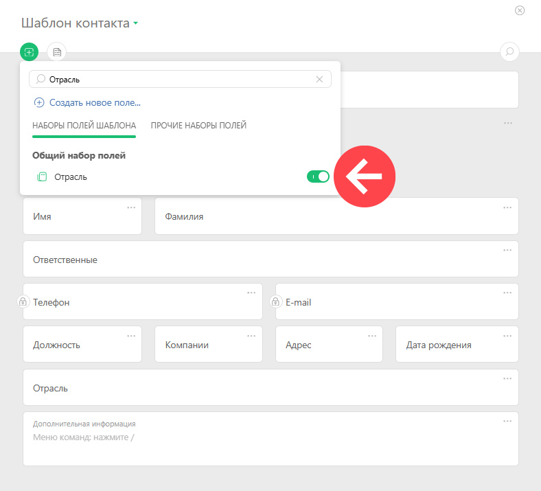
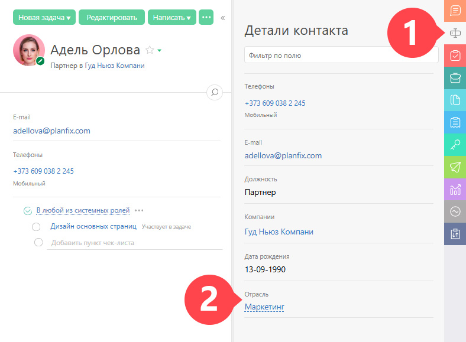
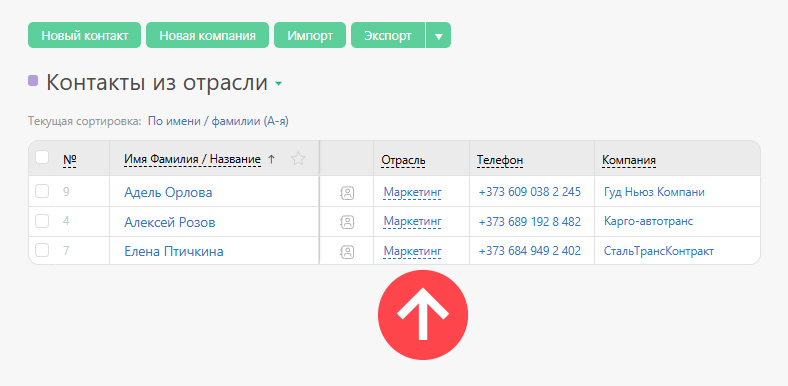
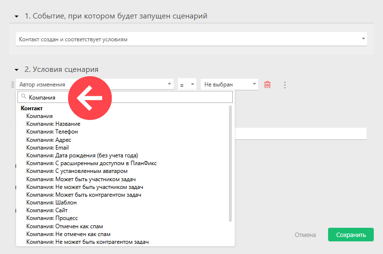
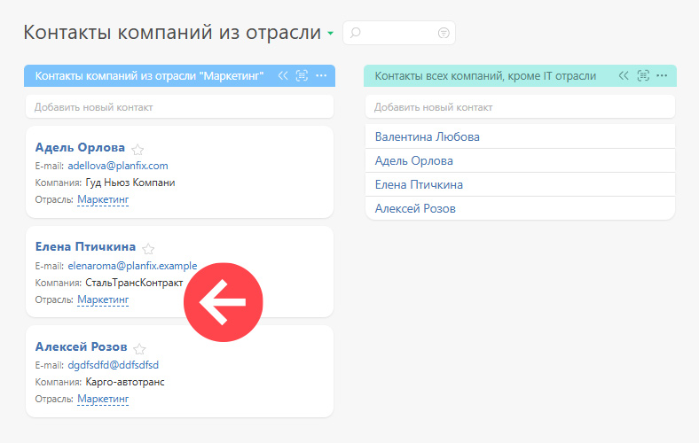
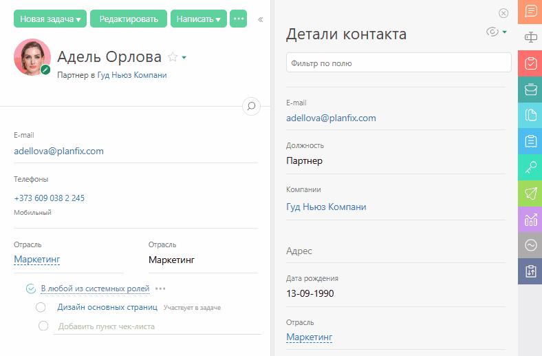

[Системные](Общие_поля.md "Общие поля") и [пользовательские](Пользовательские_поля.md "Пользовательские поля") поля компании можно отобразить в карточке [контакта](Контакты.md "Контакты"). 

Список объектов ПланФикса, в которых поля компании взаимодействуют с контактом: 

  * в шаблоне карточки контакта:

    _Обратите внимание: в шаблон контакта можно добавить системные и пользовательские поля компании._

  

  * в деталях контакта:

  

  * при фильтрации и сортировке контактов:

  

  * в автоматических сценариях контактов:

  

  * в карточке контакта в планировщике:

## Важно

  * Когда меняется значение поля в карточке компании, изменения автоматически произойдут в карточке контакта и наоборот:

## Дополнительно

  * [Поля компаний в карточке контакта](https://planfix.com/ru/blog/polya-kompanij-poyavilis-v-kartochke-kontakta/)
