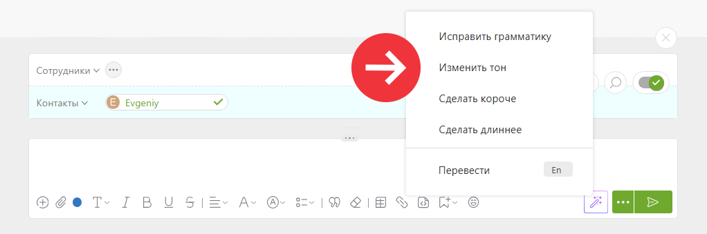

Помощник для комментариев — это [AI-инструмент, встроенный в ПланФикс](Planfix_AI.md "Planfix AI"), который помогает редактировать комментарии, улучшая их качество, тональность и стиль. 

## Возможности

  * **Исправление грамматики** — автоматически выявляет и исправляет ошибки.

  * **Изменение тона** — делает текст более профессиональным, дружелюбным, повседневным, прямолинейным или уверенным.

  * **Сокращение или расширение текста** — упрощает длинные комментарии или увеличивает короткие, сохраняя ключевой смысл.

## Как использовать

  * Напишите комментарий.

  * Выберите желаемое действие: исправить, изменить тон, сократить или расширить текст.

  * Получите готовый результат и при необходимости отредактируйте его вручную.

