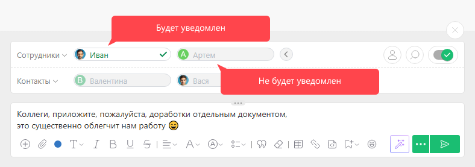
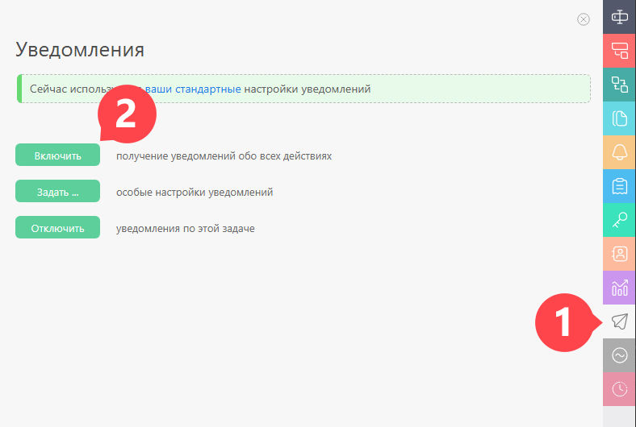

Один из основополагающих принципов ПланФикса касается уведомлений. Мы считаем, что уведомления должны направляться пользователю только в том случае, если они требуют от него какой-то реакции. 

Объяснение этому простое — мы не хотим засорять почтовый ящик и внимание пользователя неактуальной для него информацией. Именно поэтому в ПланФиксе принято выбирать, кого из участников задачи надо уведомить о совершенном вами действии. 

Для этой цели при создании нового комментария выводится блок выбора участников задачи. Все, кого вы выберете в этом блоке, получат уведомления. Остальные участники задачи смогут увидеть этот комментарий только тогда, когда сами зайдут в эту задачу. 

## Полезно

Если Вы хотите получать уведомления о новых комментариях, добавленных к конкретной задаче или ко всем задачам определенного проекта, откройте [панель Уведомления](Панель_Уведомления.md "Панель Уведомления") в нужной задаче или проекте и активируйте эту опцию: 

  

Также стоит учесть, что по умолчанию информация о критичных событиях, связанных с задачей, рассылается тем, кому она актуальна. К таким действиям относятся: 

  * Создание задачи, в которой вы являетесь исполнителем.

  * Создание задачи, в которой вы являетесь [аудитором](Аудитор_задачи.md "Аудитор задачи") (в том числе, если Вы [аудитор проекта](Аудитор_проекта.md "Аудитор проекта"), в котором создана эта задача).

  * Смена статуса задачи (Выполнена, Завершена и т.д.).

  * Смена планируемой даты завершения задачи.

## Полезная ссылка

  * [Настройка уведомлений и способов их доставки](Подписки_и_уведомления.md "Подписки и уведомления")
