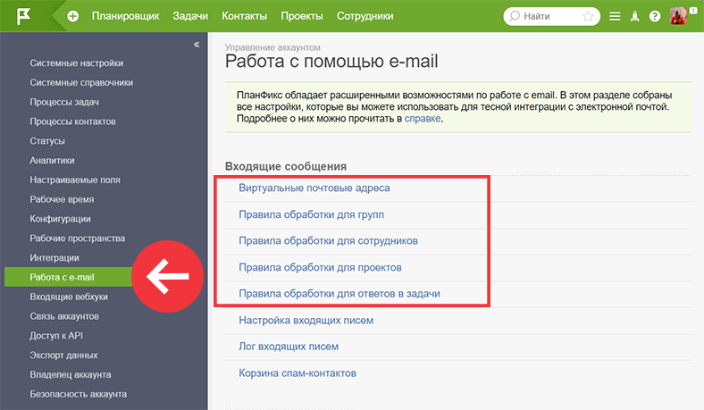
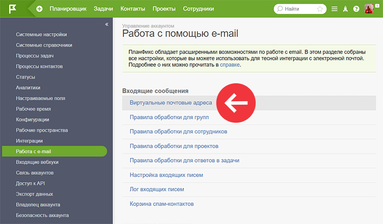
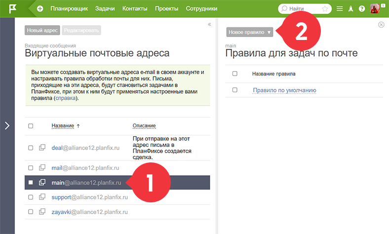
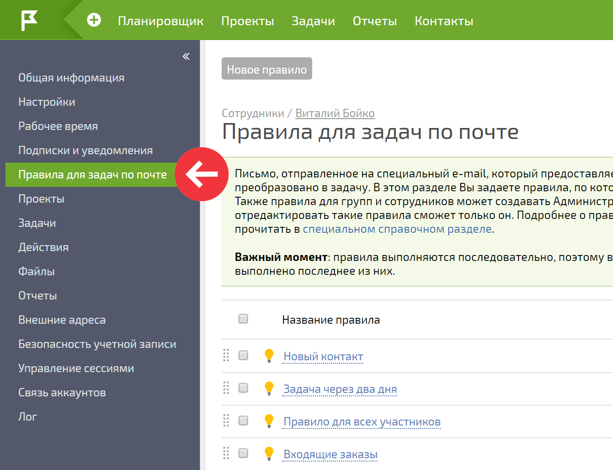

Вы можете самостоятельно задать правила, по которым письма, полученные на специальные адреса, будут преобразованы в задачи ПланФикса. Это могут быть письма на [виртуальные почтовые адреса](Виртуальные_e-mail_адреса.md "Виртуальные e-mail адреса"), [email-адреса сотрудников](Как_поставить_задачу_по_e-mail.md "Как поставить задачу по e-mail") или [проектов](E-mail_адрес_проекта.md "E-mail адрес проекта"). 

Настраиваются правила в **Управлении аккаунтом** — **Работа с e-mail** : 

  

Например, вы можете настроить правила, по которым письма, пришедшие на определенный [ виртуальный почтовый адрес](Виртуальные_e-mail_адреса.md "Виртуальные e-mail адреса"), будут преобразованы в задачи. Для этого зайдите в **Виртуальные почтовые адреса** : 

  

Выберите соответствующий адрес и создайте правила: 

  

## Работа с правилами

  * [Создание и редактирование правил](Создание_и_редактирование_правил.md "Создание и редактирование правил")

  * [Правило по умолчанию](Правило_по_умолчанию.md "Правило по умолчанию")

  * [Правила, установленные администратором](Правила,_установленные_администратором.md "Правила, установленные администратором")

  * [Правила для групп](Правила_для_групп.md "Правила для групп")

  * [Порядок выполнения правил](Порядок_выполнения_правил.md "Порядок выполнения правил")

  

## Полезная информация

  * В разделе **Правила обработки для групп** вы можете создать правила, которые будут распространяться на всех сотрудников, входящих в выбранную группу.

  * Правила обработки писем, приходящих на внутренние email-адрес сотрудника, также могут быть настроены в его [ карточки пользователя](Страница_пользователя.md "Страница пользователя"):

  

  

## Важно

При создании задачи по e-mail существует ограничение на создание контактов и их добавления в участники задачи. Например, если в поле "Копия письма" вы укажите более 20 e-mail-ов, ПланФикс не создаст новых контактов и не добавит их в участники задачи, потому что посчитает такое письмо массовой рассылкой.
