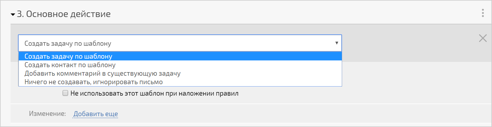
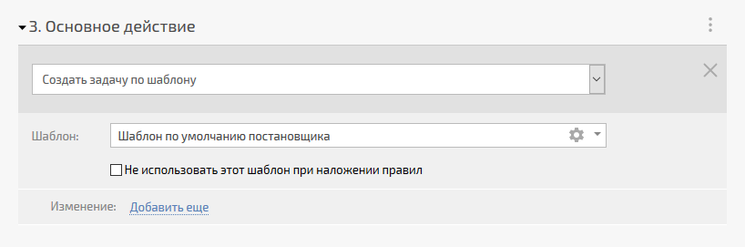
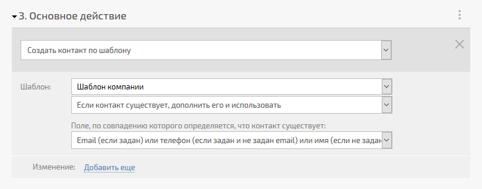
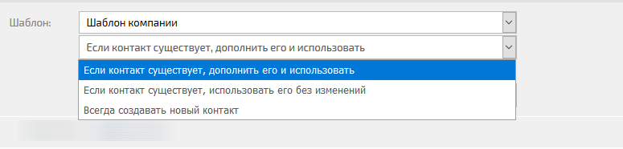
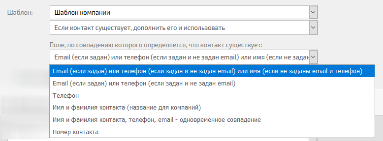
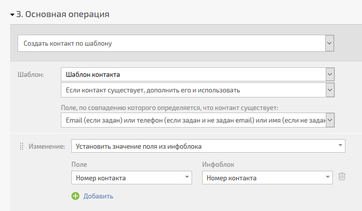
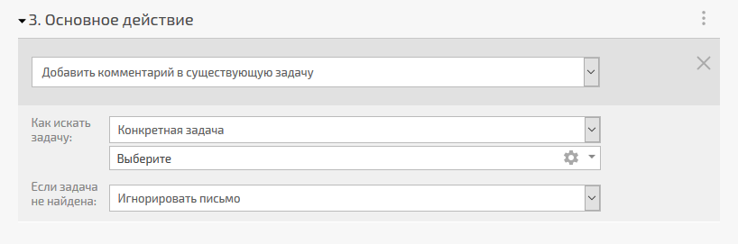
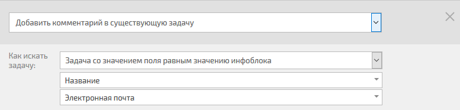
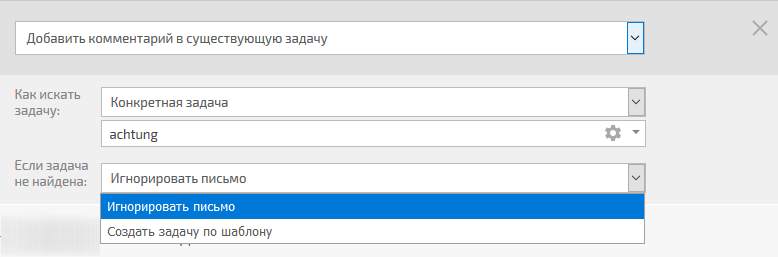

**Основная операция** \- третий блок [ правила обработки почты](Правила_создания_задач_по_e-mail.md "Правила создания задач по e-mail"), который необходимо заполнить при [ его создании](Создание_и_редактирование_правил.md "Создание и редактирование правил"). Основное действие определяет, что именно должен сделать ПланФикс из попавшего на его адрес письма - задачу, комментарий или контакт: 

  

## Создать задачу по шаблону

В этом варианте из письма будет создана задача по выбранному шаблону: 

  * В списке выбора шаблона присутствуют все шаблоны задач, имеющиеся в аккаунте, а также вариант **Шаблон по умолчанию постановщика**.

  * Опция **Не использовать этот шаблон при наложении правил** позволяет управлять выбором шаблона в случае [ наложения нескольких правил обработки для одного письма](Наложение_правил_обработки_писем.md "Наложение правил обработки писем").

  

## Создать контакт по шаблону

В этом варианте из письма будет создан контакт по выбранному шаблону: 

  * В списке выбора шаблона контакта присутствуют все существующие в аккаунте [ шаблоны контактов и компаний](Шаблоны_контактов.md "Шаблоны контактов").

  * Ниже списка шаблонов находится опция, позволяющая управлять поведением системы в случае, если такой контакт уже есть в системе:

    

  * Способ поиска существующих контакта выбирается в отдельном списке:

    

  

  * В дополнительном блоке обязательно укажите инфоблок, который содержит данные для поиска контакта. Пример конструкции для поиска существующих контактов по номеру:

  

Логика работы в данном случае такова: система осуществит поиск контакта, содержащего в поле "Номер контакта" значение, сохраненное в инфоблоке "Номер контакта". Если такой контакт найден, дальнейшие операции производятся с ним. Если контакта с таким номером в системе нет, создается новый контакт, поле "Номер контакта" в нем заполняется из инфоблока и дальнейшие операции производятся с созданным контактом. 

  

## Добавить комментарий в существующую задачу

Этот вариант позволяет найти нужную задачу и добавить содержимое письма в виде комментария к ней: 

  

  * Возможны два способа поиска нужной задачи - выбрать конкретную задачу из списка существующих в аккаунте или подобрать задачу по наличию значения, сохраненного в [ инфоблоке](Правило_для_почты__Извлечение_данных.md "Правило для почты: Извлечение данных"), в выбранном поле задачи. Например, такая настройка позволяет подобрать задачу, содержащую в названии адрес электронной почты клиента, который мы извлекли из письма в инфоблок "Электронная почта":

    

  

  * Также вы можете указать, что необходимо сделать в случае, если задача по заданному условию не найдена:

    
